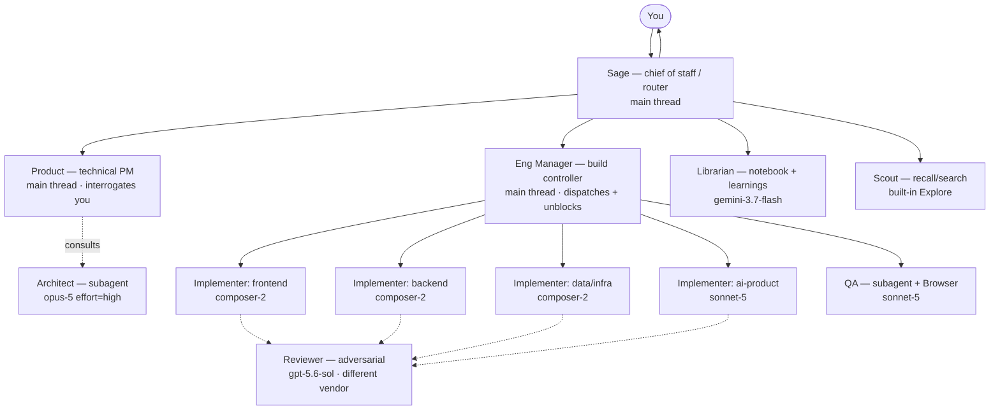
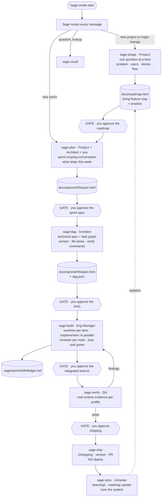

# sage-mode — Architecture v2

**Status:** draft for review · **Supersedes:** [v0.1](./architecture.html) · **Date:** 2026-08-21

> **In plain terms:** v1 was a pipeline. v2 is an organization. You talk to one agent — Sage — and underneath it there's a product manager, an architect, an engineering manager, a bench of specialist implementers, an adversarial reviewer on a different model, and a QA agent. Work is organized in sprints: one chat is one week. The research into what Cursor can actually do changed several things, and your feedback killed a few more. This document says what the org is, how it runs, what it costs, and what will break.

---

## 1. What changed from v1

> **In plain terms:** Six changes. Three came from your feedback, three from discovering what Cursor can and can't do.

| # | v1 | v2 | Why |
|---|---|---|---|
| 1 | Ceremony chosen by **time budget** (`--by 6h`) | Ceremony chosen by **scope tier** (project → sprint → task) | Your call: the goal is scaling throughput, not putting a clock on it. Scope tier is also the more honest signal — a 20-minute task and a 20-minute spike need different process, and the difference isn't duration. |
| 2 | One linear pipeline per feature | **Sprint model** — a chat is a week, a sprint ships many features as one PR | Your superpowers critique: one plan per run is too small a unit. Real products need tens of plans layering complexity. The sprint is the container that lets a chat hold more than one plan. |
| 3 | `sage-shape` produced a spec per feature | `sage-shape` produces the **project roadmap** — a living feature map every sprint updates with links | You want a map, not a pile of specs. The roadmap becomes the notebook's spine. |
| 4 | Personas as prose inside big skill files | **Roles as `agents/*.md` with per-role model assignment** | Cursor supports `model: claude-opus-5[effort=high,context=300k]` per subagent. The org chart is literally a directory of small config files. None of the five reference repos used this. |
| 5 | `sage-proof` — a `stop` hook that blocks turn-end | `sage-proof` — a `stop` hook that **nags** via `followup_message`, capped by `loop_limit` | Cursor's `stop` hook cannot block. Documented: *"Can block: No."* Different mechanism, different failure mode, honest about it. |
| 6 | `simplify-ignore`-style content hiding on read | **Deleted** | Cursor's `beforeReadFile` cannot rewrite content — *"they observe or gate access without content modification."* The pattern doesn't port. |

Also dropped: `sage-compound` as a separate skill (folded into `sage-retro`), and `sage-review` as a top-level phase (it's a role that runs *inside* `sage-build`, plus a gate before verify).

---

## 2. Thesis

> **In plain terms:** You are not a senior engineer using better tools. You are the person an engineering organization reports to. sage-mode's job is to make that organization real, cheap enough to run continuously, and disciplined enough that you can trust the output without reading every line.

Three commitments:

1. **You run an org, not a workflow.** One entry point — Sage — routes every message. Underneath sit named roles with their own models, briefs, and scopes. You do product and priority; the org does execution.
2. **The sprint is the unit.** A chat is a week. Monday you and the PM decide what ships. Tuesday–Thursday the team builds and reviews. Friday it goes up as a PR. That container is what lets a single session produce a coherent feature *set* rather than one bite-sized task.
3. **Token efficiency is a design constraint, not an optimization.** gstack proves the failure mode: `office-hours/SKILL.md` runs ~1,740 lines before its six questions start, roughly half of every large skill is repeated boilerplate, and a dedicated tool exists solely to audit the bill. We buy quality with *model tiering, retrieval, and scoping* — never with volume of prompt.

**The counterweight, stated up front:** Cursor's own research team ran the swarm experiment at scale and published the failure modes — *split-brain duplication, planner contention, merge conflicts, "megafiles," and code ossification*. The community's complaint about parallel agents is that review burden multiplies per agent. An org design that doesn't answer those specifically is a fantasy. §8 answers them one by one.

---

## 3. The organization

> **In plain terms:** Nine roles. Three of them run in your main chat because they need to talk to you. Six run as subagents with their own models. The model assignment is where cost and quality actually get decided.



| Role | Where it runs | Model | Job |
|---|---|---|---|
| **Sage** | main thread | session default (Auto) | Entry point. Classifies every message, loads the right skill, holds sprint state, refuses to let you skip a gate silently. |
| **Product** | main thread | `claude-opus-5[effort=high]` | The technical-PM interrogation. One question at a time. Runs `sage-shape` and `sage-plan`. |
| **Architect** | subagent | `claude-opus-5[effort=high,context=300k]` | Technical design and DAG decomposition. Reads the codebase, proposes structure, names failure modes. Produces a document, not a conversation. |
| **Eng Manager** | main thread | session default | Runs `sage-build`. Owns the ledger, dispatches implementers, resolves blockers, decides merge order at joins. |
| **Implementer** ×N | subagent | `composer-2` (default) / `claude-sonnet-5` (risk ≥ high) | One per DAG node. TDD, commits inside its own worktree, writes a node report. Specialties: frontend, backend, data, infra, ai-product. |
| **Reviewer** | subagent | `gpt-5.6-sol` or `gemini-3.1-pro` | Adversarial review with **a different vendor's model** — real independence, no external CLI needed. Given artifact + contract, never the author's claim. |
| **QA** | subagent | `claude-sonnet-5` + built-in Browser | `sage-verify`. Drives the real app, screenshots viewports, reads console, runs the profile's evidence suite. |
| **Librarian** | subagent | `gemini-3.7-flash` | Renders the notebook, maintains the roadmap and index, writes learnings at retro. Bulk text work on a cheap model. |
| **Scout** | built-in `Explore` | inherit | Codebase and notebook search. Backs `sage-recall`. |

**Why three roles run in the main thread:** subagents cannot ask you questions. Any interrogation, any gate, any "which of these two do you want" has to happen where you are. This is a hard constraint, not a style choice — and it's why Product and Eng Manager are personas the main agent *adopts* rather than subagents it dispatches.

**Why the reviewer is a different vendor:** Compound Engineering's line is the one to internalize — *"Two personas reasoned inside one context are two perspectives, not two witnesses."* Same model, same priors, same blind spots. Cursor's per-subagent `model` field makes cross-vendor review a one-line config change. gstack shells out to the Codex CLI to get this; we get it for free.

---

## 4. The flow

> **In plain terms:** Seven skills. `shape` runs once per project (and again on major changes). `plan` through `retro` run once per sprint — that's your week, and that's one chat.



### `sage-shape` — the project intake

Runs at project start, and again before any refactor or major change. Product interrogates you **one question at a time** — never a wall of questions — until the problem is genuinely pinned down:

- Who has this problem, and what breaks for them today?
- What do they do instead right now? (The status quo is the real competitor.)
- What is the narrowest wedge that would be genuinely useful?
- What are the user stories, in their words?
- What is the ideal flow, screen by screen or call by call?
- How will we know it worked? What is observable?

Borrowed from gstack's `office-hours`, but with its 1,740-line preamble deleted and its demand-reality test kept: *"Interest is not demand. Waitlists, signups, 'that's interesting' — none of it counts. Behavior counts."*

**Output:** `docs/roadmap.html` — the living feature map and timeline for the whole project. Not a spec. A **map**: what we're building, in what order, why, and what's shipped. Every sprint appends to it with links to that sprint's spec and plan. This is the notebook's spine and the first thing every other skill reads.

### `sage-plan` — the sprint

A three-way conversation: you, the Product persona, and the Architect (consulted as a subagent for technical reality checks). One question at a time. The frame is Monday morning sprint planning:

- What are the candidate features and bugs? (Pulled from the roadmap and any open findings.)
- What's the actual priority, and what's the dependency order?
- What's in scope this week and what explicitly isn't?
- Where's the technical risk, and what does the Architect say about it?
- What does "shipped" mean for each item?

**Output:** `docs/sprints/NN-<name>/spec.html` — the sprint contract. Plus a roadmap update marking what's in flight.

### `sage-dag` — the technical plan

The Architect turns the approved sprint spec into a task graph. Every node declares:

```jsonc
{
  "id": "n7",
  "title": "Add rate limiting to the ingest endpoint",
  "role": "backend",                    // which implementer specialty
  "depends_on": ["n3"],                 // DAG edges
  "owns": ["src/api/ingest/**", "tests/api/ingest/**"],   // file lane — enforced by hook
  "acceptance": ["429 after 100 req/min per key", "..."],
  "verify": "pnpm test tests/api/ingest",   // must pass before the node reports done
  "risk": "medium",                     // drives model tier
  "model": null                         // null = tier default, or an override
}
```

**Output:** `docs/sprints/NN/plan.html` (rendered, with the DAG as a diagram) + `dag.json` (machine-readable).

**Hard rule:** the Architect may not emit a graph where two parallel nodes have overlapping `owns` globs. Overlap forces serialization. This is what makes worktree parallelism safe, and it's the single highest-value constraint in the whole design.

### `sage-build` — the week

The Eng Manager runs it:

1. Topologically sort `dag.json` into waves.
2. For each wave, allocate a worktree per parallel lane and dispatch one Implementer subagent per node with a **file-based brief** (never pasted history — superpowers: *"Everything you paste into a dispatch prompt stays resident in your context"*).
3. Each Implementer works TDD inside its lane, commits per acceptance criterion, and writes `node-<id>-report.md`.
4. On node completion, dispatch the Reviewer (different vendor) against a diff package — artifact and contract only, never the implementer's claim. Findings loop back for up to 3 rounds; round 4 escalates the model; round 5 escalates to you.
5. At a join, merge lanes, run integration verify, resolve conflicts, update the ledger.
6. Repeat until the DAG is drained.

**Ledger:** `.sage/sprints/NN/ledger.md`, first line naming the sprint, updated after every node and join. It survives compaction — superpowers' documented worst failure: *"Controllers that lost their place have re-dispatched entire completed task sequences."* Over a chat that represents a week, compaction is a certainty, not a risk.

### `sage-verify` — QA

Post-development, pre-ship. The QA role runs the **verification profile** matching the project:

| Profile | Evidence it must produce |
|---|---|
| `web` | Real browser via Cursor's Browser subagent / Design Mode. Screenshots at 375/768/1024/1440/1920. Console errors. Every user story in the sprint spec walked end to end. |
| `api` | Contract tests against the spec, migration safety check, error-path coverage, load smoke test. |
| `cli` | Golden-file tests, real invocation in a clean sandbox, time-to-hello-world measured against the docs. |
| `ai-product` | Eval suite run, prompt regression vs. baseline, trigger/routing accuracy. |

Findings that aren't clean route straight back into `sage-build` as new nodes. No "done" without evidence in `docs/sprints/NN/evidence/`.

### `sage-ship`

Re-run verify, bump version, write the changelog from node reports, open the PR with review findings and evidence embedded. **It does not deploy.** You do that.

Optionally fires Bugbot (`POST /bugbot/review`) as a final independent pass on the PR — a fourth opinion, rate-limited to 30/min/team.

### `sage-retro`

The Librarian closes the week:

- One durable learning per notable problem → `docs/learnings/<category>/<slug>.md`, **deduped against the search index before writing** (this is where Compound Engineering's flat 78-file folder went wrong).
- Roadmap updated: what shipped, what slipped, what changed.
- Notebook re-rendered and re-indexed.
- **System tuning:** which nodes needed the most review rounds? Which briefs were ambiguous? Which model tier was wrong? Proposed edits to sage-mode's own skills land as a diff you approve. This is the part that compounds.

---

## 5. The notebook

> **In plain terms:** Project scope only, as you said. Each project grows a `docs/` website. The roadmap is the front page. Everything else hangs off it.

```
docs/
├── index.html                  # project home
├── roadmap.html                # THE MAP — features, order, status, links
├── sprints/
│   └── 03-billing-v1/
│       ├── spec.html           # what we agreed to ship
│       ├── plan.html           # the DAG, rendered
│       ├── dag.json            # machine-readable
│       ├── review.html         # findings
│       └── evidence/           # screenshots, logs, eval output
├── learnings/                  # deduped, indexed, categorized
├── decisions/                  # ADRs — why, not what
├── preferences/                # standing decisions for THIS project
└── assets/
```

Cross-project preferences live in the plugin's own user config, not in any project's notebook. A `docs/` directory belongs to one repo.

**House rules, enforced by the Librarian:** markdown is the source and HTML is the artifact; every `##` section opens with a plain-language summary before the technical detail; every DAG, flow, and state machine renders as a diagram rather than a nested list; every page is linked from the roadmap or the index; nothing external is fetched at render time.

---

## 6. Token economics

> **In plain terms:** You asked for Google-quality output without gstack's bill. That's a design problem with six specific answers, and one of them — putting the right model on each role — is worth more than the other five combined.

**The budget.** Cursor shows token usage split by category (system prompts, tools, rules, skills, MCP, subagent docs, summarized conversation, active dialogue), and `/context` in the CLI does the same. So this is measurable, and `sage-retro` should report it.

| # | Mechanism | Effect |
|---|---|---|
| 1 | **Model tiering per role** | Implementers on `composer-2`; only the Architect and Reviewer get frontier models. Cursor's own Router data reports *"Auto Intelligence: Fable-level satisfaction at 68% lower cost"* — tiering is where the money is. |
| 2 | **Skeleton skills + `references/`** | Every `SKILL.md` ≤ 120 lines, routing to reference files loaded on trigger. Cursor supports this natively: *"Agents load resources progressively—only when needed."* |
| 3 | **Zero shared preamble** | No telemetry block, no ethos injection, no repeated contract text per skill. gstack's ~800 lines of boilerplate per skill is the explicit anti-pattern. |
| 4 | **Role cards ≤ 80 lines** | A specialist is a small file with a model, a scope, and a checklist — not a personality essay. |
| 5 | **File-based briefs** | Dispatch passes paths, never pasted context. Keeps the manager's window clean across a whole sprint. |
| 6 | **`sage-recall` instead of loading** | ~25 catalog skills stay on disk until a query pulls one in. |

**The hard limit you can't optimize away:** *"Running five subagents in parallel uses roughly five times the tokens of a single agent."* Parallelism buys wall-clock, never tokens. So the DAG's job is not "maximize parallelism" — it is **maximize independent work per review**. A node that needs three review rounds cost more than three serial nodes that needed none.

⚠️ One trap to close on day one: Cursor auto-loads skills from `.claude/skills/`, `.codex/skills/`, and their global equivalents in addition to its own roots. If you have other skill libraries installed, you're paying for them every session. The IDE has a toggle; **the CLI does not**.

---

## 7. Enforcement

> **In plain terms:** Four hooks, rewritten against what Cursor actually supports. Two of them do exactly what v1 promised. One is weaker than promised. One was deleted because it's impossible.

| Hook | Event | What it does | Status vs. v1 |
|---|---|---|---|
| `sage-careful` | `beforeShellExecution` | Denies destructive shell — `rm -rf` outside a worktree, force-push to the default branch, destructive SQL against non-local DSNs. `failClosed: true`. | ✅ as designed |
| `sage-lane` | `preToolUse` matcher `Write\|Delete` | During a sprint, an Implementer may only write inside its node's `owns` globs. Denies otherwise with an `agent_message` telling it to request a lane amendment. `failClosed: true`. | ⚠️ **needs verification** — the docs show `tool_input` only for Shell; whether Write carries `file_path` is undocumented. Test before building. |
| `sage-solo` | `subagentStart` | Reviewers may not spawn subagents. Matcher on `subagent_type`; `ask` is treated as `deny`. Note Cursor allows one nesting level, so manager → implementer → reviewer is legal and intended. | ✅ as designed |
| `sage-proof` | `stop` | If the turn claims completion and the node's `verify` command hasn't passed since the last edit, return a `followup_message` forcing the fix. | ⚠️ **weaker than v1** — `stop` cannot block (*"Can block: No"*). It nags, capped by `loop_limit` (default 5). |
| `sage-bootstrap` | `sessionStart` | Injects the sprint state, the roadmap summary, and the spine index via `additional_context`. | ⚠️ **not available in Cloud Agents.** Mitigate with an `alwaysApply: true` rule as a floor. |
| ~~`simplify-ignore`~~ | — | — | ❌ **deleted.** `beforeReadFile` cannot rewrite content. |

**Two rules for every hook we ship:** set `failClosed: true` (Cursor's default is fail-open — a crashed hook silently stops enforcing), and strip the UTF-8 BOM from stdin before parsing (an [unresolved Windows bug](https://forum.cursor.com/t/on-windows-cursor-s-hook-stdin-json-payload-includes-a-utf-8-bom-that-breaks-standard-json-parse-causing-security-guards-to-silently-degrade-to-allowing-commands-across-all-agent-channels/166794) silently degrades security hooks to allow-all, including in Cursor's own doc examples).

---

## 8. Coordination — and the five ways this breaks

> **In plain terms:** You asked for agents that can communicate and get feedback from the manager. Cursor gives us no way for two subagents to talk to each other, so the manager is the bus and a shared directory is the channel. Then: Cursor's own research names five ways swarms fail. Here's our answer to each.

### How "communication" actually works

There is no peer channel. What we build instead:

```
.sage/sprints/NN/
├── ledger.md              # authoritative state — nodes, waves, joins, verdicts
├── board/
│   ├── n7.status          # claimed | building | in-review | blocked | done
│   ├── n7.blocker.md      # a question the implementer needs answered
│   └── n7.answer.md       # the manager's ruling, written back
├── briefs/n7-brief.md     # dispatch input, file-based
└── reports/n7-report.md   # dispatch output
```

An Implementer that needs something from another lane writes a blocker file and stops. The Eng Manager — the only role that sees everything — reads it, rules, writes the answer, and re-dispatches. Two mechanisms make this cheap:

- `subagentStop` returns a `followup_message`, so the manager can chain the next action automatically when a node finishes.
- `postToolUse` returns `additional_context`, so the ledger's current state can be injected right after a Task call returns — the manager stays oriented without re-reading files every turn.

**Rulings over stalls**, borrowed verbatim in spirit from superpowers: *"A wrong ruling costs rework your human partner can see and undo; a session parked on a question costs their whole day."* The manager rules and logs it. Only four categories reach you mid-sprint: destructive operations, security-sensitive decisions, effects outside the worktree, and plan defects that invalidate the spec.

### The five failure modes

Cursor published these from running swarms at scale. Ignoring them would be negligent.

| Failure | What it is | Our answer |
|---|---|---|
| **Split-brain duplication** | Two agents independently build the same thing | `owns` globs are disjoint by construction; the Architect can't emit an overlapping parallel graph. The ledger is the single claim registry. |
| **Planner contention** | Workers fight over a central plan | The DAG is frozen at Gate 2. Changes require a lane amendment through the manager, logged — the plan is never edited by a worker. |
| **Merge conflicts** | Parallel worktrees collide at the join | Disjoint lanes make same-file conflicts structurally rare. Joins are ordered by dependency, integration-verified, and the manager owns conflict resolution — never an implementer. |
| **Megafiles** | Agents pile everything into one growing file | A node with an `owns` glob resolving to a single large file is a planning smell; the Architect must split it. Reviewer checks file growth per node. |
| **Code ossification** | Nobody refactors because everything is generated | `sage-shape` re-runs on major changes. `sage-retro` surfaces churn hot-spots. Refactors are first-class sprint items, not chores. |

### And the honest one: review burden

The community's real objection to parallel agents is that each one adds a review session. Our answer is that **you don't review nodes** — the Reviewer subagent does, on a different vendor's model, per node, before the join. You review at Gate 3, once, on the integrated branch, with findings and evidence already attached. If that turns out not to be enough, the fallback is fewer, larger nodes — not more of your attention.

---

## 9. Repo layout

```
sage-mode/
├── .cursor-plugin/plugin.json
├── skills/
│   ├── sage/SKILL.md              # the router — entry point
│   ├── sage-shape/                # project intake → roadmap
│   ├── sage-plan/                 # sprint scoping → spec
│   ├── sage-dag/                  # technical plan → dag.json
│   ├── sage-build/                # the week
│   ├── sage-verify/               # QA + evidence
│   ├── sage-ship/                 # changelog + PR
│   ├── sage-retro/                # learnings + tuning
│   ├── sage-notebook/             # render + index
│   ├── sage-recall/               # search
│   └── catalog/                   # ~25, never auto-loaded
├── agents/                        # THE ORG CHART
│   ├── architect.md               # opus-5[effort=high,context=300k]
│   ├── implementer-frontend.md    # composer-2
│   ├── implementer-backend.md     # composer-2
│   ├── implementer-data.md        # composer-2
│   ├── implementer-ai.md          # sonnet-5
│   ├── reviewer.md                # gpt-5.6-sol  ← different vendor
│   ├── qa.md                      # sonnet-5 + Browser
│   └── librarian.md               # gemini-3.7-flash
├── commands/                      # /sage-mode-start, /sprint, /status
├── rules/sage-floor.mdc           # alwaysApply — bootstrap fallback for cloud
├── hooks/{hooks.json,sage-careful,sage-lane,sage-solo,sage-proof,sage-bootstrap}
├── lib/{dag,recall,notebook,board}/
├── profiles/{web,api,cli,ai-product}.json
├── templates/                     # roadmap, spec, plan, review, learning
├── docs/                          # sage-mode's own notebook (dogfood)
└── evals/                         # routing accuracy + pipeline integrity
```

---

## 10. Build order

> **In plain terms:** Six phases, each independently useful. Phase 2 is the point where sage-mode starts building sage-mode.

| Phase | Ships | Useful on its own because |
|---|---|---|
| **0 — Notebook** | `sage-notebook`, renderer, roadmap + spec + plan templates, `docs/` structure | Everything downstream writes into it. Already prototyped. |
| **1 — Front half** | `sage`, `sage-shape`, `sage-plan`, Product persona, Gates 0–1 | The interrogation-to-roadmap loop is valuable with zero agents underneath it. |
| **2 — Serial build** | `sage-dag` (graph, no parallelism), `sage-build` serial, Implementer + Reviewer roles, `sage-ship` | A working single-lane pipeline with cross-vendor review. **Dogfood from here on.** |
| **3 — Enforcement** | `sage-careful`, `sage-proof`, `sage-bootstrap`, `sage-solo` | Cheap, high-value. Verify the `sage-lane` payload question here before phase 4 depends on it. |
| **4 — Parallel** | Worktree allocation, `sage-lane`, the board, joins, integration verify | The riskiest phase. Only build it once serial is trustworthy. |
| **5 — Verify + retro** | Profiles (`ai-product` first — sage-mode is one), `sage-verify`, `sage-retro`, `sage-recall`, catalog | Closes the loop and turns the notebook into memory. |

---

## 11. Open questions

> **In plain terms:** What I'd want settled before writing code. The first two are testable in an hour.

1. **Does `preToolUse`'s `tool_input` carry `file_path` for Write?** If not, `sage-lane` isn't buildable as designed and lane enforcement falls back to `afterFileEdit` detection plus revert — strictly worse. **Test first.**
2. **Do plugin-shipped subagents honor their `model` frontmatter?** The manifest documents an `agents` field; the subagents doc doesn't mention plugin distribution. The entire cost model depends on this.
3. **How long is a sprint really?** "A week" is a scope metaphor, but the actual limit is the context window and compaction. If a sprint reliably outlives one chat, the ledger becomes load-bearing infrastructure and `sage-build` needs a first-class resume path.
4. **When does `sage-shape` re-run?** "Major changes" is doing a lot of work. Is it a manual call, or does something detect drift between the roadmap and the code?
5. **What happens to a node the reviewer rejects five times?** v2 escalates to you. But an implementer stuck in a review loop is burning tokens linearly — is there a circuit breaker that abandons the node and re-plans instead?
6. **Cursor CLI parity.** Plugin support in `cursor-agent` has broken repeatedly through 2026. If sage-mode is IDE-only, headless and scheduled runs are off the table — which forecloses Automations and the "agent picks up work from a webhook" pattern entirely.
