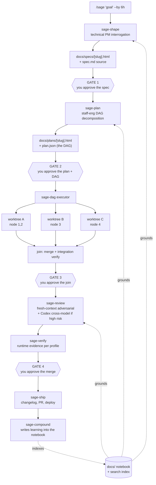

# sage-mode — Architecture Proposal v0.1

**Status:** draft for review · **Date:** 2026-08-21 · **Author:** design session with Rohit

> **In plain terms:** This is the blueprint for the repo. It proposes what sage-mode is, the ten things it always does, the twenty-five things it does only when asked, and the four hooks that stop the agent from lying to you. Read the exec summary at the top of each section; skip the technical block underneath unless you want to argue with it.

---

## 1. Thesis

> **In plain terms:** Everyone else built a *process*. We're building a *notebook that happens to execute*. Every project you touch grows a website in `docs/` — specs, plans, reviews, experiments, your preferences — and that same website is what the agents read before they do anything. The human-readable thing and the machine-readable thing are the same thing. Nobody has built this.

The five reference repos (see [Research](../research/overview.html)) converge on an identical spine and differ only in weight and enforcement. Their shared blind spot: **the artifact trail is write-only**. Compound Engineering writes learnings to a flat `docs/solutions/` directory with no index, needed a second skill to manage the rot, and accumulated 78 files. gstack ships a private knowledge-graph daemon. Superpowers and agent-skills write nothing between sessions at all.

sage-mode's bet:

1. **The project's `docs/` site is the unit of compounding.** Every spec, plan, review, experiment, decision, and learning lands there as a rendered page and a source file, linked from `index.html`.
2. **The same corpus is the agent's retrieval layer.** A BM25/ripgrep index over `docs/` plus the skill catalog answers both "what did we decide about auth?" and "which skill handles a migration?" with one mechanism.
3. **Ceremony is chosen by time budget, not task class.** `--by 6h` produces a different pipeline than `--by 3d`. No other repo has a clock.
4. **Discipline is written; enforcement is compiled.** Rationalization tables (superpowers) state the rules; Cursor hooks (gstack) make the important ones unbreakable.

Non-goals for v1: cross-harness portability (Cursor + Claude Code only), multi-user/team features, telemetry, marketplace distribution.

---

## 2. The engineering flow

> **In plain terms:** Five phases with a hard stop at each one. You approve a spec, you approve a plan, agents build it in parallel in isolated copies of the repo, a different model tears the result apart, then it ships and writes down what it learned. The gates are where you spend your attention — everything between them runs without you.



**Artifact chain, by real path:**

| Stage | Reads | Writes |
|---|---|---|
| `sage-shape` | `docs/preferences/*`, `docs/learnings/*`, repo | `docs/specs/<slug>.{md,html}` |
| `sage-plan` | the spec, `docs/learnings/*` | `docs/plans/<slug>.{md,html}`, `docs/plans/<slug>.plan.json` |
| `sage-dag` | `plan.json` | `.sage/runs/<run-id>/progress.md` (ledger), worktrees under `.worktrees/` |
| `sage-build` (per node) | `.sage/runs/<run-id>/node-<id>-brief.md` | commits in its worktree, `node-<id>-report.md` |
| `sage-review` | diff package file, node contracts | `docs/reviews/<slug>.{md,html}` |
| `sage-verify` | profile config | `docs/reviews/<slug>-evidence/` (screenshots, logs, eval output) |
| `sage-compound` | the run | `docs/learnings/<category>/<slug>.md`, updates `docs/index.html` |

---

## 3. The spine — ten skills, always available

> **In plain terms:** These are the skills that fire on a normal day. Ten, not fifty. Everything else is in a searchable catalog and stays out of your context until something actually needs it.

| # | Skill | Role | Steals from |
|---|---|---|---|
| 1 | `sage-shape` | Technical-PM interrogation, one question at a time, to a written spec. Opens with three demand-reality questions (who breaks if this doesn't exist; what's the narrowest wedge; what does "working" look like on screen). Classifies into a **time tier**. | gstack `office-hours`, CE `ce-brainstorm`, agent-skills `interview-me` |
| 2 | `sage-plan` | Decomposes an approved spec into a DAG. Each node declares: `id`, `title`, `depends_on[]`, `owns[]` (file globs), `acceptance[]`, `verify` (a command), `est_minutes`, `risk`. Refuses to emit a plan whose nodes have overlapping `owns` unless they're serialized. | superpowers `writing-plans`, CE `ce-plan` |
| 3 | `sage-dag` | Executor. Topological sort, worktree per parallel branch, one implementer subagent per node with a **file-based brief**, ledger that survives compaction, join-point merges with integration verify. | superpowers `subagent-driven-development` |
| 4 | `sage-build` | The per-node implementer contract: TDD red/green/refactor, commit per acceptance criterion, `NOTICED BUT NOT TOUCHING` scope valve, no claiming done without a fresh command run in the same message. | superpowers TDD + `verification-before-completion`, agent-skills `incremental-implementation` |
| 5 | `sage-review` | Adversarial review. Fresh context, given **ARTIFACT + CONTRACT, never the CLAIM**. Scope-gated specialists selected by what the diff touches. Findings fingerprinted `path:line:category`, deduped, confidence-gated — a finding can't score ≥7 without quoting the motivating line. Escalates to Codex CLI cross-model when risk is high. | agent-skills `doubt-driven-development`, gstack review army, CE persona roster |
| 6 | `sage-verify` | Runtime evidence, pluggable by **project profile**: `web` (Playwright, 5 viewports, console errors), `api` (contract + migration safety), `cli` (golden files, TTHW timing), `ai-product` (eval suite + prompt regression). Nothing is "done" without evidence from this layer. | gstack `/qa`, ui-ux `design-review` |
| 7 | `sage-ship` | Re-verify, changelog/version, PR with review output embedded, deploy hook. | gstack `/ship`, CE `ce-commit-push-pr` |
| 8 | `sage-compound` | Writes exactly one learning per run into `docs/learnings/`, with frontmatter (`category`, `applies_when`, `tags`), and re-indexes. Refuses to write a duplicate — checks the index first. | CE `ce-compound`, with the retrieval bug fixed |
| 9 | `sage-notebook` | The renderer and librarian. Any source doc → styled HTML page; maintains `docs/index.html`, cross-links, and the search index. Every section renders exec-summary-then-technical. | Nobody. This is ours. |
| 10 | `sage-recall` | The search layer. One query interface over the notebook corpus *and* the skill catalog. Answers "what did we decide about X" and "which skill handles Y" with the same call. | ui-ux `search.py` (BM25 subprocess), applied to a new domain |

---

## 4. The catalog — coverage without cost

> **In plain terms:** Everything gstack and agent-skills give you — security audits, migrations, observability, ADRs, accessibility — lives here. It doesn't load, doesn't fire, and doesn't cost you a token until `sage-recall` pulls it in because the task actually needs it.

Roughly 25 skills, each a `SKILL.md` with structured frontmatter (`name`, `description`, `applies_when`, `phase`, `profile`, `cost_tier`). They are **never** auto-loaded. `sage-recall` indexes their frontmatter alongside the notebook corpus.

Initial catalog, grouped: *design* (design-review, a11y-audit, design-system, ui-styling) · *safety* (security-audit, threat-model, dependency-audit, secrets-scan) · *data* (migration-safety, data-backfill, schema-review) · *ops* (observability, ci-cd, deploy-setup, canary, incident-triage) · *quality* (perf-profile, load-test, code-simplify, dead-code) · *interface* (api-contract, cli-ux, error-taxonomy) · *knowledge* (adr, doc-release, deprecation) · *ai-product* (eval-harness, prompt-regression, skill-authoring).

**Why this works and loading-everything doesn't:** ui-ux-pro-max serves 88 styles, 192 palettes, 1,935 fonts and 119 guidelines from 22 CSVs through a BM25 subprocess, returning 3–10 rows per query. Nothing enters context until it's asked for. gstack, loading everything, has a single skill file at ~1,740 lines and a tool that exists only to audit the resulting bill.

---

## 5. Enforcement — four hooks that actually block

> **In plain terms:** Four scripts that can veto the agent. They stop it deleting things, editing files outside its lane, spawning runaway subagents, and claiming success without running the tests. They don't touch your terminal — only the agent's tool calls.

[Cursor exposes 23 hook events](https://cursor.com/docs/hooks); six can return `{"permission": "deny"}`.

| Hook | Event | Enforces | Escape hatch |
|---|---|---|---|
| `sage-careful` | `beforeShellExecution` | Denies destructive shell (`rm -rf` outside worktree, force-push to default branch, `DROP TABLE` against prod DSNs). Warns on medium-risk. | `/sage-unsafe <reason>` for one turn |
| `sage-lane` | `preToolUse` (Edit/Write) | During a DAG run, each node's agent may only write inside its declared `owns[]` globs. Fail-closed: unparseable path is denied. This is what makes parallel worktrees safe. | Node declares an `owns` amendment, which re-gates |
| `sage-solo` | `subagentStart` | Implementer and reviewer subagents may not spawn their own subagents. Superpowers documented the failure: *"every reviewer a worker spawned duplicated the task review the controller dispatched anyway."* | None; this is absolute |
| `sage-proof` | `stop` | If the turn claims completion and the node's declared `verify` command has not passed since the last edit, inject a `followup_message` forcing the fix. Cursor's `stop` can auto-continue up to 5 times. | Verify command declared `none` in the plan (visible in the gate) |

Plus `sessionStart`, which is not an enforcement hook but the bootstrap: injects the spine index, the project's `docs/preferences/` summary, and any in-flight run's ledger state.

---

## 6. The time budget — the thing nobody has

> **In plain terms:** You tell it how long you've got. That single number picks how much process runs. Six hours doesn't get a four-persona plan review; three days might.

`/sage "<goal>" --by <duration>` sets a tier. The tier is declared in the spec and visible at Gate 1.

| Tier | Trigger | Pipeline | Gates |
|---|---|---|---|
| **spike** | `--by 1h`, or shape classifies as a probe | No spec file. Throwaway branch, timeboxed investigation, written finding only. | 1 (report) |
| **day** | `--by 4h`–`--by 12h` (default) | Spec (short form) → DAG → parallel build → single review pass, cross-model only if risk is high → verify → ship. | 4 |
| **project** | `--by 2d`+ | Full form: spec with alternatives considered, plan review pass before Gate 2, per-node review + whole-branch review, full catalog consultation. | 6+ |

Every skill reads the tier and adapts its own ceremony. A skill that can't do useful work in the tier says so at the gate rather than silently doing a worse job.

---

## 7. The notebook — `docs/` as the product

> **In plain terms:** Every project gets a `docs/index.html` that is a real little website: specs, plans, reviews, experiments, learnings, and your standing preferences. You browse it. The agents search it. It's the memory.

```
docs/
├── index.html              # home: what this project is, current state, recent activity
├── assets/                 # notebook.css, mermaid.min.js — vendored, offline-capable
├── specs/                  # <slug>.md (source) + <slug>.html (rendered)
├── plans/                  # <slug>.md, <slug>.html, <slug>.plan.json (the DAG)
├── reviews/                # findings + evidence/ (screenshots, logs, eval output)
├── experiments/            # things tried, results, and whether we kept them
├── learnings/              # sage-compound output, categorized, indexed, deduped
├── research/               # external teardowns and reference material
└── preferences/            # YOUR standing decisions — stack, style, defaults, vetoes
```

Design rules for every rendered page:

1. **Exec summary first, always.** Each `##` section opens with a plain-language block, then the technical detail. This is a house rule enforced by `sage-notebook`, not a suggestion.
2. **Self-contained HTML.** Inline CSS, vendored JS, no CDN. Works offline, works from `file://`, survives being zipped and mailed.
3. **Markdown is the source, HTML is the artifact.** Agents edit `.md`; `sage-notebook` renders. Git diffs stay readable.
4. **Diagrams, not nested lists.** Any DAG, state machine, or flow renders as Mermaid.
5. **Every page is linked from the index** and carries frontmatter that the search index consumes.

`docs/preferences/` is the highest-leverage directory: it holds the standing decisions you'd otherwise repeat every session (stack, testing style, what you always want, what you never want). `sage-shape` and `sage-plan` are required to read it. It's Compound Engineering's `CONCEPTS.md`, but browsable and yours.

---

## 8. Repo layout

> **In plain terms:** What actually lives in the sage-mode repo, as opposed to what it generates in your projects.

```
sage-mode/
├── plugin.json                 # Cursor Agent Plugin manifest (also works as a Claude Code plugin)
├── skills/
│   ├── spine/                  # 10 skills, each SKILL.md + references/
│   └── catalog/                # ~25 skills, indexed, never auto-loaded
├── hooks/
│   ├── hooks.json              # Cursor hook registrations
│   ├── sage-careful            # beforeShellExecution
│   ├── sage-lane               # preToolUse Edit/Write
│   ├── sage-solo               # subagentStart
│   ├── sage-proof              # stop
│   └── sage-bootstrap          # sessionStart
├── lib/
│   ├── dag.ts                  # plan.json schema, topo sort, worktree allocation
│   ├── recall/                 # BM25 index + query CLI (the ui-ux pattern)
│   ├── notebook/               # md → html renderer, index maintenance
│   └── review/                 # finding schema, fingerprint, dedup, confidence gate
├── profiles/                   # web | api | cli | ai-product verification profiles
├── templates/                  # spec, plan, review, learning, notebook page
├── docs/                       # sage-mode's own notebook (dogfood)
└── evals/                      # does the routing work? does the pipeline hold?
```

---

## 9. Build order

> **In plain terms:** What to build first so it's useful before it's finished. Each phase is independently valuable — you could stop after phase 2 and still have something you'd use.

| Phase | Ships | Why first |
|---|---|---|
| **0 — Notebook** | `sage-notebook`, `docs/` structure, renderer, index, templates | Every later phase writes into it. Also immediately useful with zero agents. |
| **1 — Spine, serial** | `sage-shape`, `sage-plan`, `sage-build`, `sage-review`, `sage-ship`; gates 1/2/4; no DAG, no parallelism | This is the whole value of four of the five reference repos. Serial execution proves the artifact chain before parallelism complicates it. |
| **2 — Enforcement** | `sage-careful`, `sage-proof`, `sage-bootstrap` | Cheap, high-value, and `sage-proof` alone kills the most common agent lie. |
| **3 — Recall** | BM25 index, `sage-recall`, catalog skills authored | Unlocks the "full lifecycle without full cost" claim. |
| **4 — DAG** | `sage-dag`, `sage-lane`, `sage-solo`, worktree orchestration, join gates | The riskiest piece; build it once the serial path is trustworthy. |
| **5 — Verify profiles** | `web`, then `ai-product`, then `api`, then `cli` | Order by what you ship most. `ai-product` matters because sage-mode is one. |
| **6 — Compound** | `sage-compound` + dedup against the index | Only meaningful once there's a corpus and a search layer to dedupe against. |

---

## 10. Open questions

> **In plain terms:** Things I'd want you to decide before I write code. None of them block phase 0.

1. **Does the plan DAG need a UI?** A rendered DAG in the plan page is read-only. Editing a node's ownership or dependencies means editing JSON or asking the agent. Gate-2 ergonomics may demand more than that.
2. **Where does `docs/` live for a project you don't own?** Committing agent notes into a work repo may be unwelcome. Options: in-repo (best for compounding), a sibling `../<project>-notebook/`, or `~/.sage/projects/<slug>/` (gstack's choice).
3. **How is a run resumed after a crash?** The ledger design (superpowers') survives compaction. Crash recovery across worktrees with partial merges is harder and needs a explicit story.
4. **Cost ceiling per run?** Nobody in the reference set tracks tokens. A `--budget` alongside `--by` would be genuinely novel, but needs a cost signal the harness may not expose.
5. **How do learnings get pruned?** CE needed a second skill for this. Better answer: `sage-compound` refuses near-duplicates at write time using the index — but "near" needs a threshold, and a wrong one silently loses knowledge.
