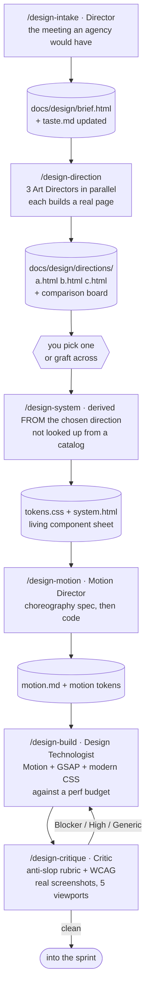

# The Design Org

**Status:** draft for review · **Date:** 2026-08-21 · Extends [Architecture v3](./architecture-v3.html)

> **In plain terms:** ui-ux-pro-max knows a great deal about design and still produces websites that look like every other AI website. That's not a knowledge problem — it's a commitment problem, and knowledge bases make it worse rather than better. This proposes six design commands and a small agency of roles that fix it: a real intake before anything gets designed, three genuinely different directions built as working pages rather than described in words, motion treated as a designed artifact instead of a fade-in, and a critic whose entire job is hunting the specific tells that make a page look AI-generated.

---

## 1. Why AI websites all look the same

> **In plain terms:** Eight mechanisms, and only one of them is about the model not knowing enough. Understanding which is which is the whole design.

1. **Mode collapse toward the training median.** Absent a hard constraint, a model emits the most probable web page. The most probable web page in 2024–2026 training data is: centered hero, `h1` + subtitle + two buttons, three feature cards with icons in coloured circles, testimonial row, logo bar, CTA. That is not a style choice; it's an argmax.
2. **Catalog recombination cannot originate.** ui-ux-pro-max offers 88 styles × 192 palettes × 74 font pairings. Every output is a point inside a space someone already enumerated. The repo effectively concedes this: it delegates "commit to a look" to a *separate* `frontend-design` skill, because the catalog itself can't do it.
3. **Tailwind's defaults are a homogenizer.** `rounded-2xl shadow-lg max-w-7xl mx-auto px-4 py-24` — every project snaps to the same radii, shadows, container, and rhythm. Different colours, identical bones.
4. **No signature element.** Memorable sites have exactly one thing you'd describe to a friend. Nothing in a normal prompt demands one, so nothing produces one.
5. **Symmetry as the default.** Centered, evenly-spaced, equal columns. Real design uses asymmetry, overlap, bleed, and deliberate imbalance to create direction and tension.
6. **Motion that isn't choreographed.** Everything gets `fade-in-up, 0.3s, ease-in-out`, each element on its own clock. That reads as *animated*, never as *designed*.
7. **Flat typographic hierarchy.** 48px heading, 16px body, 14px caption — a 3:1 range. Editorial work runs 10:1 or more, with real tracking discipline on display sizes.
8. **Generic copy makes good design look generic.** "Transform your workflow." A layout can only be as specific as the words in it.

**The consequence for design:** more catalog makes 1, 2, and 3 *worse*, not better. The fix is commitment, contrast, and constraint — plus a critic that mechanically detects the median and rejects it.

---

## 2. What ui-ux-pro-max gets right, and the two gaps

> **In plain terms:** Keep the engine, add the front and sharpen the back.

Worth keeping, per the [teardown](../research/ui-ux-pro-max-skill.html):

- **The retrieval architecture.** CSVs on disk, a from-scratch BM25 engine, `python search.py "<query>" --domain ux -n 3` returning a few ranked rows. Knowledge that grows without context cost growing. Best-in-class and we keep it wholesale.
- **The accessibility corpus.** 119 UX guidelines with Do/Don't/Code/Severity, 22 stack-specific CSVs, version-pinned so it refuses to blend framework generations rather than averaging stale and current advice.
- **The evidence-bound review.** *"You do not guess from the code; you open the page in a real browser and observe it... no finding without something you observed"*, with a Blocker/High/Medium/Nitpick taxonomy that maps to a merge decision.
- **The refusal to fabricate.** *"Never present a 0-result search as if it returned data."*

**Gap 1 — no intake.** `--design-system` is a lookup keyed on product type and a few style words. There is no moment where anyone asks what this is for, who uses it, what they should feel, what it must not look like, or what you've seen that you loved. An agency that skipped that meeting would be fired.

**Gap 2 — the output is the median.** Because the pipeline is *query → rows → merge → build*, and every step regresses toward the middle of the catalog. Nothing in it ever says "commit to this one idea and push it further than is comfortable."

---

## 3. The agency

> **In plain terms:** Six roles, mirroring how a real design consultancy is staffed. Two of them talk to you; four are subagents. The Director is the one who kills work that isn't good enough.

| Role | Runs as | Lane | Job |
|---|---|---|---|
| **Design Director** | main thread relaying a CLI session | **B** — `claude -p` sonnet-5 | Owns the brief and the taste bar. Runs intake. Chooses between directions with you. Has the authority to reject work as generic and say exactly why. |
| **Strategist** | subagent | **A** — `grok-4.5` | Jobs-to-be-done, audience context, the competitive and reference audit. Produces the constraints the Art Director works against. |
| **Art Director** | subagent ×3 (parallel) | **A** — `grok-4.6` | Three genuinely divergent directions. Typography, colour, composition, the signature element. Each one built, not described. |
| **Motion Director** | subagent | **A** — `grok-4.6` | The choreography spec — hierarchy, causality, continuity, timing, easing — written before any animation code exists. |
| **Design Technologist** | subagent | **A** — `grok-4.5` | Implementation. Motion/GSAP/modern CSS, with a performance budget it must hit. |
| **Design Critic** | subagent | **C** — `gemini-3.7-flash` | Adversarial. Runs the anti-slop rubric against real screenshots at real viewports. Evidence-bound, cannot invent findings, cannot approve without looking. |

Three Art Directors run **in parallel with deliberately different mandates** — this is the mechanism that beats mode collapse. One model asked for three directions produces three variations on its median. Three separate contexts, each given a different constraint and forbidden from the others' territory, produce three actually different things.

---

## 4. The six commands

### `/design-intake` — the meeting

One question at a time, Director voice, and it does not proceed until it can answer all of these:

- What is this for, and what happens to the business if it works?
- Who uses it? Not a persona — a specific person in a specific situation, on what device, in what state of mind.
- What are they doing immediately before and after this page?
- **What should someone feel in the first three seconds, in one word?** Then: what's the *second* word, and are they in tension?
- Name three products whose design you admire. For each: what specifically — is it the type, the motion, the density, the restraint, the audacity?
- **Name three you don't want to look like.** This is more informative than the first list.
- What is the one thing on this page you'd want someone to describe to a friend?
- What already exists — brand, logo, colours, voice? What's fixed and what's negotiable?
- Constraints: stack, CMS, accessibility floor, performance budget, browser support, who maintains it.
- Is the content real or is it lorem? *(If lorem: design will be generic no matter what we do. Say so now.)*
- How will we know it worked?

Outputs `docs/design/brief.html` and appends to `docs/design/taste.md` — the accumulating record of what you've picked and rejected, which every later direction reads first. gstack's `design-shotgun` has the same instinct ("persisted taste memory"); this makes it the front door rather than a side-effect.

### `/design-direction` — three real pages, not three descriptions

The mechanism that matters most. Three Art Directors, parallel, each with a **different assigned mandate** drawn from the brief's tension:

- **A — the restrained one.** Maximum confidence with minimum elements. Type, space, and one gesture. Nothing decorative survives.
- **B — the expressive one.** Lead with the signature element. Motion, texture, and scale contrast are the argument.
- **C — the structural one.** The layout system *is* the idea — editorial grid, rules, density, information as the aesthetic.

Each returns a **working single-page HTML comp** — real type, real colour, real spacing, one real interaction — plus a one-paragraph rationale and a named signature element. Not a mood board. Not a description. Something you can open.

Then a comparison board: the three side by side at 1440 and 390, with the Director's recommendation in the [canonical form](../research/gstack-coding-mechanics.html) — `Recommendation: <direction> because <specific reason naming what it does that the others don't>`.

**Hard rules for the Art Directors:**
- Each must name one **anti-reference** it is deliberately not doing.
- Each must state its signature element in one sentence. If it can't, it doesn't have one.
- No direction may use the default system font stack, `rounded-2xl` on everything, or a purple-to-blue gradient. Not because those are always wrong — because reaching for them is the reflex we're breaking.
- Directions may not converge: if two comps score above 0.7 similarity on the rubric's structural checks, the Director sends one back.

### `/design-system` — derived, not looked up

Tokens generated **from the chosen direction**, not retrieved from a palette catalog. The direction has a type scale because the comp has one; the system codifies what's already there and fills the gaps. OKLCH ramps so lightness steps are perceptually even. Dark mode is *designed*, not inverted. Output is `tokens.css` plus a living component sheet at `docs/design/system.html` you can actually look at.

This is where ui-ux-pro-max's data earns its place — `--domain ux`, `--domain a11y`, `--stack <name>` queried for specific answers ("keyboard focus in a modal", "React 19 form patterns") rather than consulted for taste.

### `/design-motion` — choreography before code

A spec, in prose and tokens, before a line of animation:

- **Hierarchy** — what arrives first, and why that's the most important thing on screen.
- **Causality** — what came from what. Shared-element transitions where an element genuinely persists across states.
- **Continuity** — what carries across a route change.
- **Restraint** — what deliberately does not move. Usually most of the page.

Then the token set: one base duration, a stagger expressed as a fraction of it, an entrance curve, an exit curve, spring parameters for direct manipulation, and a reduced-motion variant that swaps transforms for opacity rather than switching motion off.

### `/design-build` — implementation with a budget

The Design Technologist implements against the direction, the system, and the motion spec — with the performance budget as an acceptance criterion, not an afterthought.

### `/design-critique` — the slop detector

Adversarial, on Lane C, against **real screenshots at 390 / 768 / 1024 / 1440 / 1920** via Cursor's Browser subagent and Design Mode. Two rubrics: the accessibility pass ported straight from ui-ux-pro-max's seven-phase WCAG audit, and the anti-slop rubric below.

It inherits gstack's evidence discipline verbatim: **a finding must quote the element or cite the screenshot, or its confidence is capped and it lands in the appendix.** And it inherits the refusal: if it couldn't open the page, it says so and reports nothing rather than inventing.

---

## 5. The anti-slop rubric

> **In plain terms:** Twenty tells that mark a page as AI-generated. Each is checkable from a screenshot or the source, which means the critic can be held to evidence rather than opinion. Three or more Structural hits is an automatic fail.

### Structural (three hits = fail)

| # | Tell | Check |
|---|---|---|
| 1 | Centered hero: `h1`, one-line subtitle, two buttons side by side | Screenshot the fold |
| 2 | Three-column feature grid, icon in a coloured circle above each heading | Screenshot |
| 3 | Every section the same vertical padding | Diff computed `padding-block` across sections |
| 4 | `max-w-7xl mx-auto` (or equivalent) on every section, nothing full-bleed | Grep the container classes |
| 5 | Perfect symmetry throughout — no asymmetric ratio, no overlap, no bleed | Screenshot |
| 6 | Type scale range under 5:1 between largest and smallest | Computed `font-size` min/max |
| 7 | No signature element — nothing you'd describe to a friend | Director judgement, must name what's missing |

### Surface

| # | Tell | Check |
|---|---|---|
| 8 | Default system/UI sans as the display face with no reason given | Computed `font-family` on `h1` |
| 9 | Purple→blue (or teal→indigo) gradient used as decoration | Screenshot / grep gradients |
| 10 | `border-radius` identical on every element | Computed radii distribution |
| 11 | `box-shadow` is a single flat black at low alpha | Computed `box-shadow` |
| 12 | Dark mode is the light palette with inverted greys | Compare both palettes' hue values |
| 13 | Emoji standing in for icons | Grep |
| 14 | Round avatars in testimonial cards, grayscale logo bar | Screenshot |

### Motion

| # | Tell | Check |
|---|---|---|
| 15 | Every element uses the same fade-in-up, same duration, no stagger | Read the animation config |
| 16 | Easing is `ease`, `ease-in-out`, or `linear` everywhere | Grep easing values |
| 17 | Hover states change opacity only | Computed diff on `:hover` |
| 18 | No `prefers-reduced-motion` handling at all | Grep |

### Substance

| # | Tell | Check |
|---|---|---|
| 19 | Copy is placeholder-grade — "Transform your workflow", "Powerful features", "Get started today" | Read it |
| 20 | Nothing on the page could only be true of *this* product | Director judgement |

**Verdict scale:** `Blocker` (broken or inaccessible) · `High` (materially generic — three-plus Structural hits) · `Medium` (a tell worth fixing) · `Nitpick` (taste, non-gating). Blockers and Highs gate; the rest don't. Borrowed directly from ui-ux-pro-max's own separation of *broken* from *I'd prefer* — the discipline that keeps a critic useful instead of exhausting.

---

## 6. The craft spec

> **In plain terms:** The rubric says what not to do. This says what to do instead, specifically enough that an implementer can act on it.

**Typography.** Display sizes want a `clamp()` with a `vw` term, tracking between −0.03em and −0.05em, and optical sizing on. Pair a display face with real character against a workhorse text face — the pairing is a decision, and the brief should record why. Target 8:1 or more between display and caption. `text-wrap: balance` on headings, `pretty` on body. Measure 60–75ch for reading text, 12–20ch for display lines. `tabular-nums` anywhere numbers align.

**Layout.** Break the single centered column. Asymmetric ratios (7/5, 8/4) beat equal halves. Let something overlap something else, and let one element bleed to the edge. Vary section rhythm deliberately — a tight section next to a generous one creates pace. Hairline rules as structure is an underused editorial device. Establish a baseline grid, then break it exactly once, on purpose.

**Colour.** OKLCH ramps so lightness reads evenly. One dominant, one accent occupying under 5% of the surface. If a gradient earns its place, treat it as a light source with a direction, not a background texture. Shadows should be multi-layer and tinted toward the surface hue — a single black at 10% is the tell. Dark mode gets its own steps chosen against the dark surface.

**Motion.** One base duration; stagger as a fraction of it. Custom curves — an expo-out for entrances, a sharper curve for exits, and exits about 0.6× the enter duration. Springs for anything the user manipulates directly; durations for anything the system initiates. Distance scales inversely with element size. Nothing exceeds ~600ms unless it's ambient. In Motion (the library formerly called Framer Motion), that means variants with `staggerChildren`, `layoutId` for shared elements across states, `AnimatePresence` for exits, `useScroll`/`useTransform` for scroll linkage, and `MotionConfig reducedMotion="user"` at the root. GSAP's ScrollTrigger, Flip, and SplitText where timeline control beats declarative. Native CSS increasingly does this without JS: `animation-timeline: view()`, `@starting-style`, `@property` for animatable custom properties, and the View Transitions API for route changes.

**Interaction.** Hover should change more than opacity — position, tracking, a mask reveal, a colour shift. Design the focus state; never ship the default outline. Magnetic buttons and cursor parallax only where they carry meaning. Custom cursors are a signature element or a mistake, never neutral.

**Texture and depth.** A grain overlay at 2–4% opacity (SVG `feTurbulence` or a tiled asset) does more for perceived craft than most effects. Backdrop-blur only over real content. Hairlines via `color-mix()` against the surface rather than a fixed grey.

**Performance budget — acceptance criteria, not aspirations.** LCP under 2.5s, CLS under 0.1, INP under 200ms. Animate transform and opacity only. `will-change` applied just before an animation and removed after. Heavy WebGL lazy-mounts below the fold. Animation JS under ~40KB gzipped. **A direction that can't hit the budget is a direction that failed, and the Critic reports it as a Blocker.**

---

## 7. How it plugs into sage-mode

> **In plain terms:** Two paths. If a sprint has some UI in it, design is a required stage on those nodes. If the sprint *is* UI, the design org runs the sprint and engineering implements what it decides.

### Path A — a sprint with UI in it

`/sage-dag` marks any node whose `owns` globs touch UI paths with `design: required`. Those nodes:

1. Inherit the current `tokens.css` and motion tokens as a hard constraint — an implementer may not invent a new radius, shadow, or easing.
2. Cannot be marked done without a `/design-critique` pass on the rendered result.
3. Route Blocker and High findings back as new nodes, exactly like review findings.

If the project has **no brief yet**, the first UI node blocks and `/sage-dag` tells you to run `/design-intake` first. Designing while building is how the median wins.

### Path B — a design-led sprint

When the sprint is primarily UI, the order inverts: `/design-intake` → `/design-direction` → you pick → `/design-system` → `/design-motion` produce the artifacts, and only then does `/sage-dag` decompose — into screens and components rather than services, with the design system as the shared contract every node reads.

### `sage-verify`, web profile

The `web` verification profile invokes `/design-critique` as part of its evidence, so the accessibility audit and the anti-slop pass are one gate, with screenshots landing in `docs/sprints/NN/evidence/`.

### The taste layer

`docs/design/taste.md` accumulates every direction you picked and every one you rejected, with the reason. `/design-intake` and every Art Director read it first. **This is the design org's memory, and it is the thing that stops the tenth project from looking like the first.**

---

## 8. Open questions

1. **Do three parallel Art Directors actually diverge?** The mandate split is the theory. The test is cheap: run it once, score the three comps against the rubric's structural checks, measure whether they're genuinely different or three flavours of the same page. If they converge, the mandates need to be harder — possibly different *models* per direction rather than different prompts.
2. **Can the Critic detect "generic" reliably?** Twenty tells is a start, and about fifteen are mechanically checkable from computed styles. The other five are judgement, which means they're only as good as the model running them. Worth measuring: run the Critic against ten known-good sites and ten known-generic ones and count false positives.
3. ~~**What lane should the Art Directors run on?**~~ **Settled:** Lane A, `grok-4.6`. Three parallel Lane-B consults against a subscription's five-hour window is exactly the shape that hits a limit mid-sprint, and running an included model three times costs nothing. The Director keeps Lane B, because the intake is where being wrong is expensive. The open part is whether three runs of the *same* model diverge enough — see question 1.
4. **Is a working HTML comp the right artifact?** It's more honest than a mood board and more judgeable than a description — but it's also expensive to produce three times, and a comp that's *implemented* invites judging the implementation rather than the idea.
5. **Where does taste memory stop helping?** An accumulated record of your preferences eventually becomes a house style, which is good — until it becomes its own median. There should probably be a periodic instruction to violate it.
