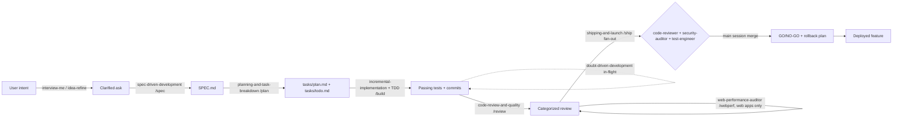

# agent-skills

A markdown-based process-enforcement library that wraps Claude Code (and 10+ other agent harnesses) in a Google-flavored senior-engineer SDLC — specs, TDD, five-axis review, and a parallel-fan-out ship gate — delivered as skills, personas, slash commands, and a handful of bash hooks.

Repo: https://github.com/addyosmani/agent-skills
Commit: `df1edb2`
Date analyzed: 2026-08-21

## TL;DR

- 24 skills (23 lifecycle + 1 meta), 4 agent personas, 8 slash commands (mirrored across `.claude/`, `.gemini/`, `commands/`), 5 hook scripts — all markdown/bash, no runtime code except the eval harness and validators.
- The real product is discipline-as-prompt: every skill ships a "Common Rationalizations" table (excuse → rebuttal) and a "Red Flags" list, designed to stop an agent talking itself out of a step.
- Enforcement is almost entirely textual, not mechanical — the two exceptions, `sdd-cache-{pre,post}.sh` and `simplify-ignore.sh`, are **opt-in** and require manual `.claude/settings.json` wiring; only `SessionStart` (injecting the meta-skill) ships wired by default.
- `/ship` is the one endorsed multi-agent pattern (parallel fan-out of `code-reviewer` + `security-auditor` + `test-engineer`, merged by the main session); an explicit anti-pattern catalog bans persona-calls-persona and router personas.
- Self-referential CI: a three-tier eval system (structural validators, TF-IDF trigger/routing evals with an 80% rank-1 floor, optional behavioral graded runs) checks the skills' own descriptions still route correctly.

## Inventory

**Skills** — from `find /root/repos/agent-skills -name 'SKILL.md' -not -path '*/.git/*'` → 24 files, one per `skills/<name>/` directory.

| Skill | Path | What it does | When it fires |
|---|---|---|---|
| using-agent-skills | skills/using-agent-skills/ | Meta-skill: discovery flowchart + 6 operating behaviors (assumptions, confusion, pushback, simplicity, scope, verify) | Session start (auto-injected) |
| interview-me | skills/interview-me/ | One-question-at-a-time interrogation to ~95% confidence | Underspecified ask; "interview me" |
| idea-refine | skills/idea-refine/ | Structured divergent/convergent ideation | Vague concept needing exploration |
| spec-driven-development | skills/spec-driven-development/ | Gated SPECIFY→PLAN→TASKS→IMPLEMENT, Phase 0 capability-map for multi-capability asks; 6-section spec | New project/feature, no spec yet |
| planning-and-task-breakdown | skills/planning-and-task-breakdown/ | Decompose spec into small ordered tasks with acceptance criteria | Spec exists, need units |
| incremental-implementation | skills/incremental-implementation/ | Vertical-slice implement→test→verify→commit loop; flags, safe defaults | Any multi-file change |
| test-driven-development | skills/test-driven-development/ | RED-GREEN-REFACTOR, Prove-It bug pattern, test pyramid 80/15/5, DAMP-over-DRY, Beyoncé Rule | Implementing/fixing/changing behavior |
| context-engineering | skills/context-engineering/ | Rules files, context packing, MCP integration | Session start, task switch, quality drop |
| source-driven-development | skills/source-driven-development/ | DETECT→FETCH→IMPLEMENT→CITE against official docs | Want source-cited framework code |
| doubt-driven-development | skills/doubt-driven-development/ | CLAIM→EXTRACT→DOUBT→RECONCILE→STOP adversarial review, optional cross-model | High stakes / unfamiliar code |
| frontend-ui-engineering | skills/frontend-ui-engineering/ | Component architecture, design systems, state, WCAG 2.1 AA | Building/modifying UI |
| api-and-interface-design | skills/api-and-interface-design/ | Contract-first design, Hyrum's Law, One-Version Rule | Designing APIs/module boundaries |
| browser-testing-with-devtools | skills/browser-testing-with-devtools/ | Chrome DevTools MCP live runtime verification | Anything browser-facing |
| debugging-and-error-recovery | skills/debugging-and-error-recovery/ | reproduce→localize→reduce→fix→guard; stop-the-line rule | Tests/builds fail |
| code-review-and-quality | skills/code-review-and-quality/ | Five-axis review, change sizing (~100 lines), severity labels | Before merging any change |
| code-simplification | skills/code-simplification/ | Chesterton's Fence, Rule of 500, complexity reduction | Code harder than it should be |
| security-and-hardening | skills/security-and-hardening/ | OWASP Top 10, auth, secrets, dependency audit, boundary tiers | Untrusted input, auth, storage |
| performance-optimization | skills/performance-optimization/ | Measure-first, Core Web Vitals, profiling, bundle analysis | Perf requirements/regressions |
| git-workflow-and-versioning | skills/git-workflow-and-versioning/ | Trunk-based dev, atomic commits, semver/changelog | Any code change (always) |
| ci-cd-and-automation | skills/ci-cd-and-automation/ | Shift Left, feature flags, quality-gate pipelines | Build/deploy pipeline work |
| deprecation-and-migration | skills/deprecation-and-migration/ | Code-as-liability, compulsory vs advisory deprecation | Removing/migrating/sunsetting |
| documentation-and-adrs | skills/documentation-and-adrs/ | ADRs, API docs, "document the why" | Architectural decisions, shipping |
| observability-and-instrumentation | skills/observability-and-instrumentation/ | Structured logging, RED metrics, OTel tracing, alerting | Adding telemetry, shipping to prod |
| shipping-and-launch | skills/shipping-and-launch/ | Pre-launch checklist, flag lifecycle, rollback | Preparing to deploy |

**Agents** (`agents/*.md`, 4 files) — each has a mandatory "Composition" block stating invoke-directly / invoke-via / do-not-invoke-from-persona.

| Name | Role | Model | Tools/notes |
|---|---|---|---|
| code-reviewer | Senior Staff Engineer | not pinned (docs suggest Sonnet) | Five-dimension review, Critical/Important/Suggestion, output template |
| security-auditor | Security Engineer | not pinned (docs suggest Opus) | STRIDE from trust boundaries, OWASP Top 10 + LLM Top 10 |
| test-engineer | QA Engineer | not pinned (docs suggest Haiku) | Prove-It pattern, test-level decision tree, coverage-gap report |
| web-performance-auditor | Web Performance Engineer | not pinned | Quick mode (source scan only) vs Deep mode (Lighthouse/CrUX/DevTools MCP); Metric-Honesty Rule forbids fabricated CWV numbers |

**Commands** (`.claude/commands/`, 8 files, mirrored in `.gemini/commands/` and `commands/` as `.toml`)

| Name | Role |
|---|---|
| /spec | Invokes spec-driven-development; six-area spec saved to SPEC.md |
| /plan | Invokes planning-and-task-breakdown; plan → tasks/plan.md, todo → tasks/todo.md |
| /build | Invokes incremental-implementation + test-driven-development; default = one task, `auto`/`all` = whole plan with a single human approval gate |
| /test | TDD workflow / Prove-It pattern for bugs |
| /review | Single-perspective five-axis review |
| /code-simplify | code-simplification workflow, tests re-run after every simplification |
| /webperf | Spawns web-performance-auditor subagent, Quick/Deep mode selection |
| /ship | Parallel fan-out: code-reviewer + security-auditor + test-engineer spawned in one turn, merged by main session into GO/NO-GO + rollback plan; skip-fan-out only allowed for ≤2 files, <50 lines, no auth/payments/data/config touch |

**Hooks** (`hooks/`, 5 scripts + `hooks.json` + 2 doc files)

| Event | What it enforces | Wired by default? |
|---|---|---|
| SessionStart (`session-start.sh`, registered in `hooks/hooks.json`) | Injects the full `using-agent-skills` meta-skill body as `additionalContext` into every new session | Yes — the only hook in `hooks.json` |
| PreToolUse `WebFetch` (`sdd-cache-pre.sh`) | Blocks a WebFetch (exit 2) and returns cached content only if the origin confirms HTTP 304 via `If-None-Match`/`If-Modified-Since`; no TTL, no cache without an ETag/Last-Modified validator | No — manual `.claude/settings.json` addition per `hooks/SDD-CACHE.md` |
| PostToolUse `WebFetch` (`sdd-cache-post.sh`) | Stores `{url, prompt, etag, last_modified, content, fetched_at}` in `.claude/sdd-cache/<sha256(url)[:32]>.json`; issues an extra HEAD request to capture validators since Claude Code doesn't expose them | No — same as above |
| PreToolUse `Read` / PostToolUse `Edit\|Write` / `Stop` (`simplify-ignore.sh`) | Replaces `/* simplify-ignore-start[: reason] */ ... simplify-ignore-end */`-fenced code with `BLOCK_<hash>` placeholders before the model reads the file, and expands them back after edits, restoring originals on session Stop — makes annotated code literally invisible to `/code-simplify` | No — manual `.claude/settings.json` addition per `hooks/SIMPLIFY-IGNORE.md` |

## The core engineering flow

The repo's own README diagram: `DEFINE → PLAN → BUILD → VERIFY → REVIEW → SHIP` mapped to `/spec /plan /build /test /review /ship` (plus `/code-simplify` and `/webperf` as review-phase specialists). Reconstructing the artifact chain from the skill/command bodies:

1. **interview-me / idea-refine** (optional, pre-spec) — clarify intent; no artifact yet, just confidence.
2. **`/spec` → spec-driven-development** — Phase 0 capability map if the ask bundles multiple capabilities → `SPEC.md` (Objective, Commands, Structure, Code Style, Testing Strategy, Boundaries). Human approves before Phase 2.
3. **`/plan` → planning-and-task-breakdown** — reads `SPEC.md`, produces `tasks/plan.md` (dependency-ordered) and `tasks/todo.md` (acceptance criteria + verify step). Plan-mode only, no edits.
4. **`/build` → incremental-implementation + test-driven-development** — per task: RED → GREEN → full suite → build → commit. `/build auto` needs a clean git baseline and one explicit approval of the whole plan, then runs every task's loop unattended, stopping only for irreversible/high-risk tasks (→ doubt-driven-development) or unfixable failures (→ debugging-and-error-recovery).
5. **doubt-driven-development runs in-flight during step 4** on any non-trivial decision — spawns a fresh-context adversarial reviewer with ARTIFACT+CONTRACT only (never the CLAIM), classifies findings, loops ≤3 times.
6. **`/test`** — Prove-It pattern is the local TDD loop, feeding the same passing-suite artifact forward.
7. **`/review` → code-review-and-quality** — produces a categorized review (Critical/Important/Suggestion) across five axes; `/code-simplify` optionally follows, re-testing after each simplification.
8. **`/webperf` → web-performance-auditor** (web apps only) — Deep mode (Lighthouse/CrUX/DevTools-MCP) or Quick mode (source only); scorecard forbids fabricated metrics.
9. **`/ship` → shipping-and-launch, fan-out** — `code-reviewer` + `security-auditor` + `test-engineer` in parallel on the same diff; main session merges into `GO | NO-GO` + mandatory rollback plan; any Critical finding defaults to NO-GO.
10. **git-workflow-and-versioning / documentation-and-adrs / observability-and-instrumentation / deprecation-and-migration** run alongside as ship-phase hygiene, each producing its own artifact.

## Core beliefs / principles

- **Tests are proof, not decoration.** `skills/test-driven-development/SKILL.md`: `"Tests are proof — 'seems right' is not done."`
- **Confidence is not correctness.** `skills/doubt-driven-development/SKILL.md`: `"A confident answer is not a correct one... a fresh-context reviewer — biased to disprove, not approve — before any non-trivial output stands."`
- **Orchestration belongs to the user, never a persona.** `AGENTS.md`: `"the user (or a slash command) is the orchestrator. Personas do not invoke other personas."`
- **A spec is the cure for silent assumptions.** `skills/spec-driven-development/SKILL.md`: `"Code without a spec is guessing."`
- **Simplicity is mandatory.** `skills/using-agent-skills/SKILL.md`: `"If you build 1000 lines and 100 would suffice, you have failed."`
- **Sycophancy is a named failure mode.** `skills/using-agent-skills/SKILL.md`: `"'Of course!' followed by implementing a bad idea helps no one."`
- **Review approves progress, not perfection.** `skills/code-review-and-quality/SKILL.md`: `"Approve a change when it definitely improves overall code health, even if it isn't perfect."`
- **Refactors must remove concepts, not relocate them.** `skills/code-review-and-quality/SKILL.md`: `"Relocating complexity isn't reducing it... look for the version where branches disappear."`
- **Metrics without measurement are fabrication.** `agents/web-performance-auditor.md`: `"Never fabricate metrics... Violating this rule is worse than returning no scorecard at all."`
- **Code is a liability.** README explicitly cites Google's engineering-practices lineage: Hyrum's Law, the Beyoncé Rule, trunk-based dev, Shift Left, Chesterton's Fence.

## Mechanics worth stealing

- **Anti-rationalization tables as the load-bearing artifact.** Every skill maps excuse → rebuttal, e.g. `test-driven-development`: `"I tested it manually" → "Manual testing doesn't persist. Tomorrow's change might break it with no way to know."` A cheap, reusable pattern for any prompt meant to survive an agent's shortcut-seeking under pressure — put the objection and its counter in the prompt instead of hoping the instruction alone holds.
- **"NOTICED BUT NOT TOUCHING" scope-discipline escape valve.** `skills/incremental-implementation/SKILL.md` gives agents a way to log out-of-scope observations instead of silently fixing or silently ignoring them: `NOTICED BUT NOT TOUCHING: src/utils/format.ts has an unused import (unrelated) → Want me to create a task?`
- **ARTIFACT + CONTRACT, never CLAIM, to the reviewer.** `doubt-driven-development`'s anti-sycophancy trick: strip your own conclusion before handing work to a fresh-context reviewer, because *"if you hand over conclusions, you'll get back validation of your conclusions."* Reusable for any self-review loop.
- **Freshness-honest caching via HTTP validators, not TTL.** `hooks/sdd-cache-pre.sh`/`-post.sh` serve cache only after a live `304 Not Modified` revalidation; entries without `ETag`/`Last-Modified` are never cached. A pattern for an agent-safe cache that can't silently go stale.
- **Making code invisible instead of asking the model to ignore it.** `hooks/simplify-ignore.sh` swaps annotated blocks for content-addressed `BLOCK_<hash>` placeholders on `Read`, restoring them on `Stop` — a hard technical guarantee in place of a soft instruction.
- **Explicit orchestration anti-pattern catalog.** `references/orchestration-patterns.md` names four failure classes (router persona, persona-calls-persona, paraphrasing orchestrator, deep persona trees), each with why it degrades output — a design checklist before any multi-agent feature.
- **TF-IDF trigger-collision testing for a prompt catalog.** `evals/README.md`: Tier 2 computes stemmed TF-IDF over descriptions, asserts rank-1 ≥80%, flags ≥50%/≥75% pairwise similarity — a deterministic, free CI check for "will my new skill get picked over an existing one."
- **Single approval gate for autonomy.** `/build auto`: one unambiguous human "go," then the agent runs the whole task list unattended but still commits per-task and stops on irreversible/high-risk work.

## Weaknesses / where it breaks down

- **Enforcement is almost entirely textual.** Outside SessionStart injection, nothing stops an agent from skipping a skill; the two hooks that enforce anything (`sdd-cache`, `simplify-ignore`) require hand-editing `.claude/settings.json` and ship unwired. No hook blocks a commit without tests, blocks `/ship` without a green suite, or verifies a spec exists before `/build` — the `/build auto` spec-file check is prose the agent is trusted to follow.
- **The whole system is a very large system prompt.** `using-agent-skills` alone is injected in full at every session start; 24 skills average ~370 lines, and `docs/skill-anatomy.md`'s own "under 500 lines" guidance is already brushed by `security-and-hardening` (499). Nothing prevents multiple long skills stacking in one session.
- **The eval system tests routing, not correctness.** `evals/README.md` admits Tier 2 is "a lexical approximation of routing... it cannot judge semantics." Behavioral Tier 3 is opt-in and token-costed, so the CI-guaranteed floor is "the right skill's name gets mentioned," not "the workflow was followed correctly."
- **`doubt-driven-development` and `/ship` assume subagent isolation** that Claude Code provides but other harnesses don't uniformly offer — the "degraded self-questioning fallback" for doubt-driven admits it "is not fresh-context review."
- **No mechanical guarantee against scope creep or dead-code accumulation** — `incremental-implementation` and `code-review-and-quality` both rely on the agent noticing and asking, not any static check.
- **Heavy self-referential overhead.** CONTRIBUTING pre-flight checks, `evals/`, `scripts/validate-*.js`, and skill-anatomy rules exist to maintain the pack itself — irrelevant baggage if vendored wholesale into an unrelated project.
- **Persona model assignments are aspirational, not pinned.** `references/orchestration-patterns.md` suggests Haiku for `test-engineer`, Opus for `security-auditor`, but `agents/*.md` frontmatter carries no `model:` field — cost optimization is documented, not applied.

## Fit for a solo senior engineer shipping a production feature in a day

**Carries over well:** the Prove-It bug-fix pattern, vertical-slicing discipline, the five-axis review checklist as a self-review pass, and ~100-line commit sizing are all immediately useful without any multi-agent machinery — good habits encoded as prompts for a single session. `/ship`'s fan-out is genuinely valuable for a solo engineer specifically because it substitutes for the second-pair-of-eyes a team would normally provide.

**Pure overhead for a one-day push:** the gated four-phase spec workflow with Phase 0 capability maps, `doubt-driven-development`'s cross-model escalation machinery, `deprecation-and-migration`, ADR discipline, and the entire eval/validator apparatus are built for a team maintaining a long-lived shared prompt library, not shipping one feature fast. Installing the whole plugin injects the ~190-line meta-skill at every session start regardless of task size — cherry-picking `test-driven-development`, `incremental-implementation`, and `code-review-and-quality` (or just `/build` → `/review`) captures most of the value at a fraction of the context cost.
