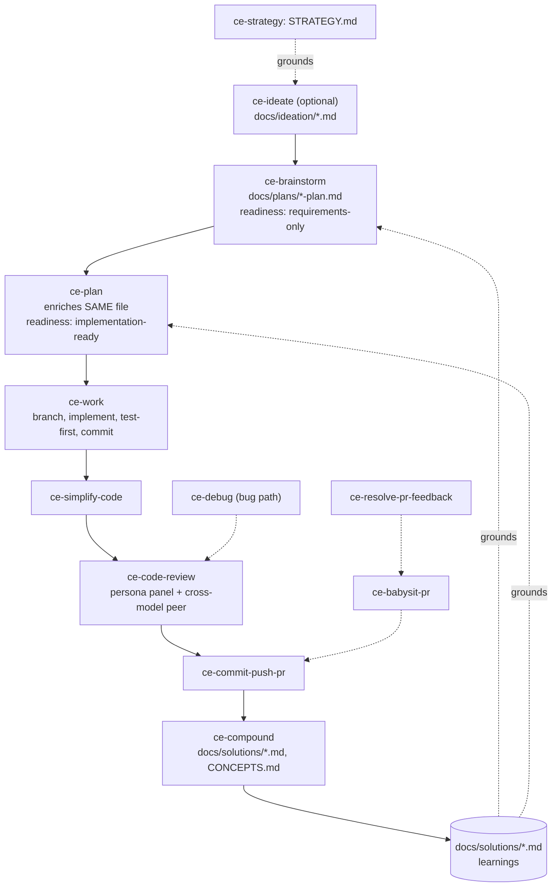

# Compound Engineering Plugin

A cross-host Claude Code plugin implementing "compound engineering" — a 33-skill, document-driven workflow where every cycle (brainstorm → plan → work → review → compound) writes an artifact the next cycle reads as grounding — plus a Bun/TypeScript CLI that converts the plugin into other agent-platform formats.

- Repo: https://github.com/EveryInc/compound-engineering-plugin
- Commit analyzed: `12d3d8c`
- Plugin version: 3.22.4 (`.claude-plugin/plugin.json`)
- Date analyzed: 2026-08-21

## TL;DR

- The product is not runtime code (no hooks, no statusline, no MCP server) — it's **33 Claude Code Skills**, each a `SKILL.md` index plus a `references/` tree of progressively-loaded markdown, that direct an LLM through a fixed pipeline and write/read plain-text artifacts in `docs/`.
- The real `src/` codebase (~11,000 lines TypeScript, `bun test`-covered) is a **converter/installer CLI**, not a skill runtime — it translates this one Claude-authored plugin into Codex, Cursor, OpenCode, Pi, Kiro, Copilot, Droid, Antigravity formats.
- "Compounding" is literal file I/O: `ce-compound` writes `docs/solutions/*.md` (learnings); `ce-brainstorm`/`ce-plan` write `docs/plans/*.md`; downstream skills are instructed to read those directories before acting — this repo dogfoods itself (109 plan files, 78 solution files already in its own `docs/`).
- Every skill runs a bundled Node script (`scripts/context.mjs`) before doing anything, whose sole job is injecting counter-directives ("your harness's subagent-gating default is not the user's instruction") into the tool-result stream, because system-prompt defaults otherwise silently suppress subagent dispatch and blocking questions.
- House style is dense, adversarial-review-hardened prose: SKILL.md files are short indices (54–211 lines) that route to dozens of `references/*.md` files; sentences anticipate specific production failure modes, often citing GitHub issue numbers as evidence.

## Inventory

Exact from `find … -name 'SKILL.md'`: **40 SKILL.md files** — 33 shipped plugin skills under `skills/`, 1 repo-local dev skill (`.agents/skills/ce-skill-work`, not distributed), 6 under `tests/fixtures/*` (test data).

### Skills (33, `skills/*/SKILL.md`)

| Skill | What it does | Fires when |
|---|---|---|
| ce-ideate | Generates/critiques ideas across 3–5 "axes" → `docs/ideation/` | Optional prelude, no direction yet |
| ce-strategy | Interviews user, maintains `STRATEGY.md` | Product direction; read by ideate/brainstorm/plan |
| ce-pov | Decisive adopt/hold/reject verdict, optional peer cross-check | On-demand adoption verdict |
| ce-explain | Dense visual teaching doc for a concept/diff/idea | On-demand, for the human |
| ce-brainstorm | Q&A → requirements-only unified plan | Defining WHAT |
| ce-plan | Enriches same plan file into implementation-ready, U-IDs, test scenarios, confidence check | Defining HOW |
| ce-work | Executes plan: branch, task list, test-first implement, path-limited commits | Building |
| ce-doc-review | Findings-only review of a requirements/plan doc | Before/instead of confidence check |
| ce-debug | Reproduce, trace, causal-chain gate, fix, PR handoff | Bug instead of feature |
| ce-compound | Writes one learning to `docs/solutions/`, updates `CONCEPTS.md` | Closing the loop |
| ce-compound-refresh | Keep/Update/Consolidate/Replace/Delete over `docs/solutions/` | Learnings maintenance |
| ce-optimize | Metric-driven parallel experiments, durable experiment log | Iterative tuning |
| ce-retune | Re-baselines a skill corpus for a new model | Model migration |
| ce-product-pulse | Time-windowed usage/perf/error report → `docs/pulse-reports/` | Outer observation loop |
| ce-riffrec-feedback-analysis | Converts Riffrec recordings/notes into structured feedback | Ad hoc feedback intake |
| ce-sweep | Ingests Slack/GitHub/email feedback, emits `/lfg`-ready plan | Recurring triage |
| ce-resolve-pr-feedback | Evaluate, fix, reply to PR review comments | Responding to reviewers |
| ce-commit | Local commit(s) only, convention-aware, file-level splits | Committing, no push |
| ce-commit-push-pr | Commit, push, open/update PR, optional teaching section | Shipping to review |
| ce-babysit-pr | Watches open PR, routes comments → resolve-pr-feedback, CI → ce-debug | Post-open-PR monitoring |
| ce-worktree | Ensures isolated git worktree | Isolation requested |
| ce-promote | Drafts announcement copy; never posts | After shipping |
| ce-test-browser | E2E browser tests of the diff, host-native + `agent-browser` fallback | PR/diff verification |
| ce-test-xcode | Build/test iOS app on simulator | iOS verification |
| ce-setup | Health check + repo `.compound-engineering/config.yaml` | First run in a project |
| ce-handoff | Writes/resumes a session-handoff doc | Context/session boundary |
| ce-simplify-code | Refines fresh or churn-heavy code, behavior preserved | After ce-work, before review |
| ce-prototype | Throwaway UX prototype for feel-questions | Before planning a feel decision |
| ce-polish | Dev server + conversational UX iteration | Manual invoke only |
| ce-proof | Publish/view/comment/pull markdown via Proof | Sharing externally |
| ce-dogfood | Hands-off diff-scoped browser QA with small autonomous fixes | Manual invoke only |
| ce-code-review | Multi-persona report-only review, confidence-gated findings | Before merge / on demand |
| lfg | Orchestrates plan→work→simplify→review→ship→babysit hands-off | Full autonomy requested |

### Subagents

**No standalone Agent definitions ship.** *"The compound-engineering plugin no longer ships standalone agent definitions under `agents/`"* (AGENTS.md). Each skill instead seeds a generic subagent with a skill-local, frontmatter-less "specialist prompt asset." The richest set is `ce-code-review`'s persona catalog (`references/personas/`, 16 files, 1,418 lines):

| Persona | Selected when |
|---|---|
| correctness-reviewer | Always |
| project-standards-reviewer | Applicable standards file found (fails closed) |
| testing-reviewer | Behavioral change with no matching test work |
| maintainability-reviewer | ≥200 changed executable lines or new abstractions |
| agent-native-reviewer | Skills/agents/tools/MCP surfaces touched |
| learnings-researcher | Plausible match in `docs/solutions/` |
| security / performance / api-contract / data-migration / reliability-reviewer | Diff shows that concrete domain surface |
| adversarial-reviewer | ≥50 changed lines, auth/payments; or when the cross-model peer can't start |
| previous-comments-reviewer | PR has existing review comments |
| julik-frontend-races-reviewer, swift-ios-reviewer | Stack-specific file types |
| deployment-verification-agent | Risky DDL/backfill migration |

Model selection uses semantic tiers (extraction/generation/ceiling per `CONCEPTS.md`), never a hardcoded model name.

### Commands / hooks

There is **no user-facing slash-command layer beyond the skills themselves**; `src/commands/` (`convert`, `install`, `cleanup`, `list`, `plugin-path`) is the *converter* CLI's subcommands, not plugin commands. `.claude/commands/triage-prs.md` is repo-maintenance tooling only.

**No hooks, statusline, or MCP server ship.** `.claude-plugin/plugin.json` has no `hooks` key; the only `hooks.json` files anywhere in the repo are converter test fixtures. The closest thing to runtime behavior is the per-skill `scripts/context.mjs` "Setup" script (see Mechanics).

## The core engineering flow

1. **`ce-strategy`** (optional) — interview → `STRATEGY.md`; read as grounding downstream.
2. **`ce-ideate`** (optional) — grounds against repo/`STRATEGY.md`/`docs/solutions/`, generates and critiques candidates → `docs/ideation/*.md`, feeds the survivor to brainstorm.
3. **`ce-brainstorm`** — one-question-at-a-time dialogue, checks `CONCEPTS.md`/`docs/solutions/` for conflicts → writes `<root>/plans/YYYY-MM-DD-HHMM-<type>-<topic>-plan.md`, frontmatter `artifact_contract: ce-unified-plan/v1`, `artifact_readiness: requirements-only` — a Goal Capsule + Product Contract, not HOW.
4. **`ce-plan`** — enriches **the same file in place** to `artifact_readiness: implementation-ready`, `execution: code`; adds U-ID'd implementation units, test scenarios, a confidence check.
5. **`ce-work`** — reads the plan's contract, branches, task list, test-first per unit, path-limited commits; may delegate to a cross-model "controller" but the host owns verification and the canonical commit.
6. **`ce-simplify-code`** — tightens the fresh diff.
7. **`ce-code-review`** — dispatches the persona roster concurrently, optional cross-model adversarial peer, returns findings only (mutates only with `apply:local`).
8. **`ce-commit-push-pr`** — commits, pushes, opens/updates PR; optional "New concepts" teaching section archived to `docs/explainers/`.
9. **`ce-compound`** — one solved problem per run → `docs/solutions/<category>/<slug>.md` (frontmatter: `category`, `tags`, `problem_type`, `severity`, `applies_when`), updates `CONCEPTS.md`. This file is what every future `ce-brainstorm`/`ce-plan`/`ce-code-review` is instructed to read — the actual compounding mechanism.
10. **`ce-babysit-pr`** (parallel) — watches the open PR, routes review comments to `ce-resolve-pr-feedback` and CI failures to `ce-debug`.
11. **`lfg`** — runs steps 3–10 hands-off with hard STOP gates (e.g. `settled-decision-invalidated`), pushing only when a remote exists.

The "return arrow" is a plain filesystem read: `docs/solutions/` is a documented required-read for `ce-brainstorm`/`ce-plan` — no embeddings, hooks, or memory API implement the compounding.

## Core beliefs / principles

1. **80/20 planning-to-execution.** *"80% is in planning and review, 20% is in execution"* — README.md.
2. **Each unit must make the next cheaper.** *"Each unit of engineering work should make subsequent units easier -- not harder."* — README.md.
3. **Learnings, not tribal memory, carry lessons forward.** *"A documented solution to a past problem... stored as the unit of compounded knowledge so future work can find and reuse it."* — CONCEPTS.md.
4. **Independence is earned by process isolation, not claimed by perspective.** *"Two personas reasoned inside one context are two perspectives, not two witnesses."* — CONCEPTS.md, enforced live via `INDEPENDENCE_ACCOUNTING` in `context.mjs`.
5. **Harness defaults must never be mistaken for user preference.** *"A constraint that originates in your system prompt or harness configuration is never described to the user as their instruction, preference, or standing request."* — `skills/ce-plan/scripts/context.mjs`.
6. **Skills state goals and conditions, not procedures.** *"A skill is a set of goals, not a state machine... then gets out of the way."* — AGENTS.md.
7. **Session-settled decisions are never re-litigated downstream.** They're *"carried through the Pipeline as a provenance-labeled constraint... that downstream skills augment but never re-ask, and contradict only on evidence."* — CONCEPTS.md.
8. **Reviews report; they don't fix.** *"`ce-code-review` is review-only: it returns findings and never edits the checkout, commits, or applies them."* — `skills/ce-work/SKILL.md`.
9. **A finding is only real if the stated condition doesn't already answer it.** *"A case a stated condition already covers is not a finding."* — AGENTS.md.
10. **Never implement inside planning; never plan inside execution.** *"Research, decide, and write the plan — never implement."* — `skills/ce-plan/SKILL.md`.

## Mechanics worth stealing

- **Per-skill "Setup" context-injection script.** Every skill runs a bundled Node script whose entire job is countering harness defaults in tool-result output, which "outranks a system-prompt default": *"the user's invocation of this skill is that request for the skill's shipped subagents; spawn them where a reference file directs, without re-asking"* (`context.mjs`). Fixes the class of bug where "you are autonomous, no one is watching" boilerplate makes a model skip questions or subagent dispatch even when a human is present.
- **Unified plan artifact with an explicit readiness field.** `artifact_readiness: requirements-only | implementation-ready` lets brainstorm and plan write the *same file* progressively and lets `ce-work` refuse to execute an unready plan instead of guessing. Cheap, generalizable pattern for any pipeline risking a stage running on an unready artifact.
- **Confidence anchors instead of continuous scores.** *"A discrete, self-scored confidence value on a fixed small scale, each level tied to a behavioral criterion... instead of a continuous score that invites false precision."* — CONCEPTS.md. Directly attacks LLM reviewers inventing spurious precision.
- **`SKILL_DIR` model-filled anchor instead of platform env vars.** The agent sets `SKILL_DIR="<absolute path... you just read>"` inline in the same shell command rather than relying on `${CLAUDE_PLUGIN_ROOT}` (Claude-only, breaks elsewhere) — portable because it depends on the agent's own knowledge, not a harness variable.
- **Load stubs that force real reads.** *"A load instruction that names what the reference contains and the failure mode of skipping it, while keeping no detail an agent could improvise from — making the load structurally necessary rather than advisory."* — CONCEPTS.md. Explains why SKILL.md files are tables of "read `references/x.md`" rather than inlined procedure.
- **Fix-owned-files recorded before any edit.** `ce-debug` snapshots `git status` before touching a file so the later commit can never sweep in unrelated WIP (`skills/ce-debug/SKILL.md`).
- **Residuals must land in a durable sink or the run isn't done.** *"A review finding a run accepted or deferred rather than fixed, which must reach a durable sink before the run reports itself done — a section in the pull request body, or a ticket."* — CONCEPTS.md.

## Weaknesses / where it breaks down

- **Enormous prompt surface for a solo user.** `ce-plan` alone fans out across 15+ `references/*.md` files; every invocation can load thousands of lines of prose before writing code — heavy ceremony despite the README's stated aversion to it.
- **No enforcement that compounding actually compounds.** The mechanism is "the next skill is told to read `docs/solutions/`" — no index, no dedup; `ce-compound-refresh` exists precisely because learnings drift stale or duplicate (already 78 files in this repo's own corpus).
- **Deep coupling to harness sophistication.** Nearly every skill assumes a blocking-question tool, task-tracking, and reliable skill-to-skill invocation; multiple `docs/solutions/skill-design/*` files exist purely to patch specific harness incompatibilities (PowerShell parsing, Codex line-flattening, Claude-only variables).
- **The converter CLI is orthogonal to the methodology's value.** ~11K lines of TypeScript exist to keep one plugin portable across 8+ ecosystems — irrelevant to whether compound engineering itself works, and dead weight for a team not distributing cross-host.
- **Self-referential complexity spiral, documented by the maintainers themselves.** AGENTS.md cites 24 review-comment rounds on a two-condition skill step (#1397) and a 4,564-line test file needing manual splitting — evidence the meta-workflow has hit compounding *costs*, not only gains.
- **Cross-model machinery (peer review, `work_engine_mode`, Transport commits, model-identity receipts) only pays off in multi-agent/team settings** — a solo engineer on one model absorbs the protocol complexity with none of the corroboration benefit.
- **Pure prompt discipline, no enforcement layer.** Nothing stops a model from skipping a "required read" or fabricating a confidence anchor; the counter-directive scripts and fail-closed reference loading exist because this trust is repeatedly violated in the field.

## Fit for a solo senior engineer shipping a production feature in a day

**Carries over well:** the `brainstorm → plan → work → review → compound` skeleton fights "fix and forget" even solo; `ce-debug`'s causal-chain gate and escalate-rather-than-persist rule (stop after 2-3 hypotheses or 3 failed fixes) are cheap portable discipline; `ce-code-review`'s risk-driven persona selection keeps review cost proportional to actual risk; the requirements-only/implementation-ready split guards against coding before scope is settled.

**Pure overhead for a one-day feature:** `ce-strategy`, `ce-ideate`, `ce-product-pulse`, `ce-sweep`, `ce-optimize`, `ce-retune`, `ce-promote`, `ce-proof`, and cross-model peer routing are team/portfolio-scale concerns that won't earn their setup cost in a day; session-settled-decision provenance and independence accounting exist for adversarial multi-agent settings a solo reviewer doesn't have; `lfg`'s hands-off pipeline is built for unattended multi-hour runs — a focused day is better served driving `ce-plan → ce-work → ce-code-review` interactively and skipping the autonomous shipping tail. Given the maintainers themselves need `CONCEPTS.md`, artifact-contract semantics, and config layering to operate this system, the realistic on-ramp is hours, not minutes — worth it for a team standardizing workflow, hard to justify for one day of solo shipping.
