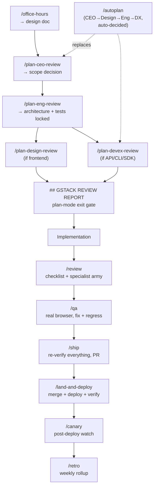

# gstack

Garry Tan's opinionated Claude Code skill-suite that turns a solo builder into a simulated engineering org (CEO, eng manager, designer, QA, security, release engineer) via ~53 Markdown-defined slash commands plus a compiled headless-browser daemon.

Repo: https://github.com/garrytan/gstack
Commit analyzed: `51932ec` (2026-08-19)
Date analyzed: 2026-08-21

## TL;DR

- Not a framework, a **process**: `office-hours → plan-*-review → build → review → ship → land-and-deploy → retro`, encoded as 54 SKILL.md units (one is the repo-root router; 53 are invokable commands).
- Every skill is generated from a `.tmpl` at build time (`gen-skill-docs.ts`); a shared ~800-line boilerplate preamble (telemetry, AskUserQuestion contract, ETHOS injection, gbrain context load) is the biggest single engineering investment in the repo — bigger than most skills' unique logic.
- Quality gates are real: an `Agent`-tool "review army" of scope-gated specialist subagents (testing, maintainability, security, performance, data-migration, api-contract, red-team, design) produces confidence-scored, fingerprint-deduped findings; `/cso` runs a 14-phase OWASP+STRIDE audit; `/careful`/`/freeze`/`/guard` are Claude Code hooks, not prompts.
- ETHOS.md is explicit and load-bearing: **Boil the Ocean** (AI made completeness cheap, so do the whole thing), **Search Before Building** (three layers of knowledge), **User Sovereignty** (AI recommends, human decides — never act on cross-model agreement alone).
- Heavy coupling to Garry Tan's own stack: Bun, a compiled Playwright/Chromium daemon, gbrain (his other project), Supabase telemetry, Conductor for parallel sessions, and a "10-15 parallel sprints" workflow that assumes supervision bandwidth most solo engineers don't have.

## Inventory

53 command units + 1 root router, from `find /root/repos/gstack -maxdepth 2 -iname SKILL.md | grep -v tmpl` (54 files), grouped by lifecycle phase. Descriptions from each unit's frontmatter + body.

### Plan

| Unit | Path | What it does | Fires on |
|---|---|---|---|
| office-hours | `office-hours/` | Six forcing questions (demand reality, status quo, specificity, narrowest wedge, observation, future-fit) in Startup mode, design brainstorm in Builder mode; writes a design doc | "brainstorm this", pre-plan |
| plan-ceo-review | `plan-ceo-review/` | CEO persona, 4 scope modes (Expansion/Selective/Hold/Reduction), 18 cognitive patterns (Bezos doors, Munger inversion) | `/plan-ceo-review` |
| plan-eng-review | `plan-eng-review/` | Eng-manager persona; locks architecture/diagrams/error map/test matrix, 15 cognitive patterns | `/plan-eng-review` |
| plan-design-review | `plan-design-review/` | Rates each design dimension 0-10 vs. "what a 10 looks like"; AI-slop detection | `/plan-design-review` |
| plan-devex-review | `plan-devex-review/` | TTHW benchmarking, magical-moment design, friction tracing, 3 modes | `/plan-devex-review` |
| autoplan | `autoplan/` | Chains CEO→Design→Eng→DX, auto-answers via 6 decision principles, surfaces only taste/"user challenge" calls | `/autoplan` |
| design-consultation | `design-consultation/` | Full design system from scratch, writes `DESIGN.md` | new project |
| spec | `spec/` | 5-phase intent→executable spec; Codex gate blocks <7/10; fail-closed secret redaction | filing a spec/issue |
| plan-tune | `plan-tune/` | Self-tunes AskUserQuestion sensitivity per question id; builder psychographic | background |

### Build / operate

| Unit | Path | What it does | Fires on |
|---|---|---|---|
| investigate | `investigate/` | Root-cause debugging; "no fixes without investigation"; auto-freezes scope; stops after 3 failed fixes | bug reports |
| qa / qa-only | `qa/`, `qa-only/` | Real Chromium, clicks flows, fixes bugs + regression tests (`qa`) or reports only (`qa-only`) | `/qa <url>` |
| browse | `browse/` | Headless-Chromium CLI/daemon (`$B` commands: snapshot, click, fill, screenshot, cdp) | any browser-needing skill |
| open-gstack-browser | `open-gstack-browser/` | Headed, branded, anti-bot-stealth Chromium + sidebar agent | interactive browsing |
| setup-browser-cookies | `setup-browser-cookies/` | Imports cookies from the user's real browser | authenticated testing |
| pair-agent | `pair-agent/` | Shares one browser across AI agents via scoped tokens/tab isolation | multi-agent coordination |
| scrape / skillify | `scrape/`, `skillify/` | Prototype-then-codify page extraction; freezes a successful flow into a reusable skill | one-off / codified scraping |
| design-shotgun | `design-shotgun/` | 4-6 GPT-Image mockup variants, comparison board, persisted taste memory | visual exploration |
| design-html | `design-html/` | Mockup → production HTML/CSS via "Pretext" computed-layout, framework-aware | after shotgun/CEO plan |
| codex | `codex/` | OpenAI Codex CLI wrapper: pass/fail gate, adversarial challenge, open consult | cross-model second opinion |
| ios-qa | `ios-qa/` | Drives a real iPhone over USB CoreDevice via embedded StateServer; optional Tailscale | live-device iOS testing |
| ios-fix / ios-design-review / ios-clean / ios-sync | 4 dirs | Autonomous fix loop; 10-dim HIG audit; strip debug bridge pre-release; regen bridge | iOS workflow |
| careful | `careful/` | PreToolUse hook: warns/hard-denies destructive shell commands | "be careful" |
| freeze / guard / unfreeze | 3 dirs | PreToolUse hook locks Edit/Write to one directory; `guard`=careful+freeze; `unfreeze` clears it | scoped debugging |
| context-save / context-restore | 2 dirs | Persist/resume git state + decisions, across Conductor workspaces | context switches |
| learn | `learn/` | Review/search/prune/export cross-session project learnings (JSONL) | memory management |
| diagram / make-pdf | 2 dirs | English→mermaid+`.excalidraw`+SVG/PNG triplet; Markdown→PDF/HTML/DOCX | diagramming, publishing |

### Review

| Unit | Path | What it does | Fires on |
|---|---|---|---|
| review | `review/` | 2-pass checklist + specialist subagent army + adaptive gating + cross-review dedup of previously-skipped findings | `/review`, inline in `/ship` |
| design-review | `design-review/` | Live-site visual audit + atomic-commit fixes + before/after screenshots | live audit |
| devex-review | `devex-review/` | Live DX audit: real docs, timed TTHW, screenshots errors; compares vs. `plan-devex-review`'s prediction | post-ship DX check |
| cso | `cso/` | 14-phase OWASP+STRIDE audit (secrets, supply chain, CI/CD, infra, webhooks, LLM/AI security...); independent per-finding verification | `/cso` |
| health | `health/` | Type checker + linter + tests + dead code dashboard | periodic |
| benchmark / benchmark-models | 2 dirs | Page-load/CWV baseline+diff; cross-model (Claude/GPT/Gemini) skill benchmark | perf regression, model comparison |

### Ship

| Unit | Path | What it does | Fires on |
|---|---|---|---|
| ship | `ship/` | Automated: sync base, tests, coverage audit, plan-completion check, review army, VERSION/CHANGELOG bump, push, open PR | `/ship` |
| land-and-deploy | `land-and-deploy/` | Merges PR, waits on CI/deploy, verifies prod health; first run is a dry-run | `/land-and-deploy` |
| canary | `canary/` | Post-deploy monitoring loop (console errors, perf, page failures) | after deploy |
| landing-report | `landing-report/` | Read-only dashboard over the workspace-aware ship queue | parallel-sprint status |
| document-release / document-generate | 2 dirs | Diffs docs vs. code, updates stale ones, Diataxis coverage map; generates missing docs | inline in `/ship`, or standalone |
| setup-deploy | `setup-deploy/` | One-time deploy-platform detection (Fly/Render/Vercel/Heroku) | before first deploy |
| gstack-upgrade | `gstack-upgrade/` | Self-updates gstack | version drift |

### Learn

| Unit | Path | What it does | Fires on |
|---|---|---|---|
| retro | `retro/` | Team-aware weekly retro: per-person breakdowns, shipping streaks, test-health trends | weekly |
| setup-gbrain / sync-gbrain | 2 dirs | Bootstrap and refresh a persistent cross-session/cross-machine memory store (gbrain) | onboarding, keeping memory fresh |

### Agents — subagent dispatch, not static config files

No `agents/` directory of persona/model/tool YAML exists (`agents/openai.yaml` is a Codex-plugin manifest, not a roster). The README's "23 specialists" are personas written into each SKILL.md's prompt body. The only literal spawned subagents are generic `Agent`-tool dispatches — always `subagent_type: "general-purpose"`, model inherited from the parent session (no per-agent model pin found anywhere) — each carrying one checklist as its prompt:

| Name (checklist file) | Role | Model | Tools |
|---|---|---|---|
| testing, maintainability | `review/specialists/*.md` | always-on code reviewers (diff ≥50 lines) | general-purpose (inherited) |
| security, performance, data-migration, api-contract | `review/specialists/*.md` | scope-gated (SCOPE_AUTH/BACKEND/MIGRATIONS/API) | general-purpose (inherited) |
| red-team | `review/specialists/red-team.md` | finds what other specialists missed; gated on diff>200 lines or a CRITICAL | general-purpose (inherited) |
| design | `review/design-checklist.md` | scope-gated on SCOPE_FRONTEND | general-purpose (inherited) |
| adversarial / greptile-triage / plan-completion / test-coverage / doc-release | `ship/sections/*.md` | independent second-pass reviewers, fresh context, dispatched by `/ship` | general-purpose (inherited) |
| CSO finding-verifier | `cso/SKILL.md` | independent per-finding FP check, blind to the original scan's reasoning | general-purpose (inherited) |

Dispatch pattern is uniform: launch all selected specialists in one message (true parallelism), each gets a fresh context window, findings return as line-delimited JSON, get fingerprinted (`path:line:category`), deduped (confirmed-by-multiple boosts confidence), and confidence-gated (≥7 shown, 5-6 shown with caveat, 3-4 appendix-only, 1-2 suppressed).

### Hooks (`hosts/claude/hooks/`)

| Event | File / mechanism | What it enforces |
|---|---|---|
| PreToolUse (Bash) | careful's hook | Warns (MEDIUM) or hard-denies (HIGH: `rm -r /`, force-push to default branch) |
| PreToolUse (Edit/Write) | freeze's hook, shares extractor with careful | Fail-closed directory boundary; unparseable payload denied; symlinks resolved to target |
| PreToolUse (AskUserQuestion) | `question-preference-hook.ts` | Auto-decides per stored `never-ask` preference; refuses to guess if ambiguous |
| PostToolUse (AskUserQuestion) | `question-log-hook.ts` | Deterministic answer capture, dedup by tool_use_id, backs `/plan-tune` |
| PostToolUse (AUQ error) | `auq-error-fallback-hook.ts` | On a transport/missing-result error (seen on Conductor), reminds the model to use the prose fallback |
| Stop | `timeline-stop-hook.ts` | Closes dangling `"started"` timeline entries from interrupted sessions (fail-open, ≤2s, always exits 0) |
| Stop (opt-in) | `gstack-verify-gate` (bin) | Blocks turn-end until a declared `<!-- gstack:verify: -->` command passes; needs per-repo trust grant |

## The core engineering flow

**Artifact chain:**

1. **`/office-hours`** → **design doc** (`~/.gstack/projects/<slug>/*-design-*.md`, mirrored to `docs/designs/`).
2. **`/plan-ceo-review`** reads it, challenges scope in 1 of 4 modes, appends a `## CEO Plan` section.
3. **`/plan-eng-review`** locks architecture/diagrams/tests, appends `## GSTACK REVIEW REPORT` — the plan-mode exit gate checks for this before `ExitPlanMode` is allowed.
4. **`/plan-design-review`** (if frontend) and **`/plan-devex-review`** (if API/CLI/SDK) rate and edit the plan toward a 10/10. **`/autoplan`** chains all four with the 6 Decision Principles auto-answering everything except premises and cross-model "User Challenges."
5. Implementation happens outside any gstack skill, against the locked plan.
6. **`/review`** (standalone or inline in `/ship` Step 9) diffs vs. base, runs the checklist (SQL/data-safety + LLM trust-boundary as CRITICAL), dispatches the review army, auto-fixes AUTO-FIX findings, batches ASK findings into one AskUserQuestion, loops up to 3 fix-cycles, logs to the **Review Readiness Dashboard**.
7. **`/qa`** drives the real browser against staging, fixes bugs, generates a regression test per fix.
8. **`/ship`** re-runs everything (tests, coverage, plan-completion, review army, adversarial/Codex cross-check, Greptile triage), bumps VERSION/CHANGELOG, auto-invokes `/document-release`, pushes, opens the PR with review output embedded.
9. **`/land-and-deploy`** merges, waits on CI/deploy, verifies prod health (dry-run explained the first time only).
10. **`/canary`** watches the deploy for console errors/perf regressions; offers a revert on trouble.
11. **`/retro`** rolls the week's timeline/telemetry into a per-person, per-repo report.

## Core beliefs / principles

1. **Boil the Ocean** — completeness is now cheap, ship the whole thing. *"When the complete implementation costs minutes more than the shortcut — do the complete thing. Every time."* (`ETHOS.md`)
2. **Three layers of knowledge before building** — tried-and-true, new-and-popular, first-principles; prize Layer 3. *"The best projects both avoid mistakes... while also making brilliant observations that are out of distribution (Layer 3)."* (`ETHOS.md`)
3. **User Sovereignty overrides model consensus** — *"Two AI models agreeing on a change is a strong signal. It is not a mandate... the user is right. Always."* (`ETHOS.md`) — operationalized in `autoplan/SKILL.md` as the non-auto-decidable "User Challenge" class.
4. **Zero silent failures, named errors** — *"Don't say 'handle errors.' Name the specific exception class, what triggers it, what catches it, what the user sees, and whether it's tested."* (`plan-eng-review/SKILL.md`)
5. **Stale diagrams are a defect, not neutral** — *"Stale diagrams are worse than no diagrams — they actively mislead."* (`plan-eng-review/SKILL.md`)
6. **The user's words beat the founder's pitch** — *"There is almost always a gap between what the founder says the product does and what users say it does."* (`office-hours/SKILL.md`)
7. **Interest is not demand** — *"Waitlists, signups, 'that's interesting' — none of it counts. Behavior counts. Money counts. Panic when it breaks counts."* (`office-hours/SKILL.md`)
8. **Confidence must be evidenced** — *"If you cannot quote the motivating line(s), the finding is unverified. Force its confidence to 4-5... Do not work around this by inventing speculative confidence 7+."* (`ship/sections/review-army.md`)
9. **The task is the boundary, not license to widen it** (bounded-scope model overlay) — *"Interpret 'complete,' 'full,' 'exhaustive'... as complete within that boundary, never as permission to widen it."* (`model-overlays/gpt-5.6-sol.md`) — in direct tension with #1, resolved per-model rather than universally.
10. **Build for yourself** — *"gstack exists because its creator wanted it. Every feature was built because it was needed, not because it was requested."* (`ETHOS.md`)

## Mechanics worth stealing

- **Skeleton + on-demand sections.** Large skills are a short decision-tree with a routing table (`| When | Read this section |`) into `sections/*.md` files, read only when triggered — real context-budget discipline, generated from `.tmpl` so docs can't drift from code (`ARCHITECTURE.md`).
- **Verification-gated confidence.** Findings need `path:line` plus *quoted* motivating code before confidence ≥7 is allowed; two specialists hitting the same fingerprint boost each other and get tagged "MULTI-SPECIALIST CONFIRMED." Previously-skipped findings are suppressed on re-review only if the file hasn't changed since (`ship/sections/review-army.md`).
- **AskUserQuestion as a structured decision brief.** Every question carries a plain-English "ELI10," `Recommendation: X because Y`, per-option `Completeness: N/10`, minimum-length pros/cons, and a documented fallback chain (native tool → MCP variant → prose) for unreliable hosts.
- **Auto-decide with an explicit exception carve-out.** `autoplan`'s 6 principles auto-answer intermediate questions, but premises and any "User Challenge" (models agreeing the user's stated direction should change) are hard-excluded — User Sovereignty as code, not prose.
- **Content-addressed test evidence.** `gstack-wtree` hashes the working tree, not the commit, so FRESH/STALE grading survives rebases/squashes — `/ship` cites prior runs instead of re-running suites.
- **Physical listener separation over header-based trust.** The browse daemon's tunnel-facing port has no `/health` or `/cookie-picker` routes at all, rather than inferring trust from headers on one socket (`ARCHITECTURE.md`).
- **Asymmetric egress policy.** Every off-machine send writes a hash-chained receipt first; sensitive sinks refuse to send if the write fails, user-directed sends fail open with a warning — a deliberate per-sink-class split, not one global rule.

## Weaknesses / where it breaks down

- **Enormous per-skill token overhead.** `office-hours/SKILL.md` runs ~1,740 lines before the six forcing questions start; roughly half of every large skill is identical boilerplate (telemetry, gbrain sync, AskUserQuestion contract, checkpoint mode) repeated per skill — big enough that `gstack-context-bill` exists solely to audit it.
- **Deep coupling to one person's stack.** Bun, a compiled Playwright/Chromium daemon, gbrain (a separate private project), Supabase telemetry, and Conductor for the "10-15 parallel sprints" the README frames as the payoff. Adopting the workflow discipline means inheriting all of it.
- **"Boil the ocean" is scope-creep pressure by default.** The ethos argues against "ship the shortcut" outright; `plan-ceo-review`'s "SCOPE EXPANSION" mode and `autoplan`'s "choose completeness" principle push toward more work, counterbalanced only by a bounded-scope model overlay most models don't get.
- **Sprawl.** 53 command units, 88 `bin/` binaries, a full iOS live-device QA subsystem, a personal knowledge-graph integration, cross-model benchmarking, and browser automation are one install. Most is orthogonal to "review a diff and ship it," yet all of it loads preamble machinery every invocation.
- **Assumes near-constant human availability.** Plan reviews, the CSO audit, and User Challenges all block on a human decision-maker; running many parallel sprints (the headline use case) requires the operator reachable across all of them at once — visible via the dashboard, not solved by it.
- **Self-referential validation.** Telemetry and "eureka moment" logs feed the same tool that produces the README's productivity claims; no external benchmark shows the review army finds more real bugs than one well-prompted pass would.

## Fit for a solo senior engineer shipping a production feature in a day

**Carries over cheaply, without installing gstack:** the AskUserQuestion decision-brief format (ELI10 + recommendation + scored options + pros/cons); the pre-emit verification gate for findings ("quote the line or confidence caps at 4-5"); parallel, fresh-context, checklist-scoped specialist subagents with fingerprinted findings instead of one long review pass; named failure modes over "handle errors"; the skeleton + on-demand-section structure for any prompt library past a few hundred lines.

**Pure overhead for one day, one feature:** the full plan gauntlet (CEO→Eng→Design→DX) is team-sprint scale, not one afternoon — `/autoplan` reduces but doesn't remove the cost; gbrain/telemetry/egress-receipts/Supabase sync is cross-session/cross-machine memory infrastructure a single day never needs; iOS live-device QA, cross-model benchmarking, and `/pair-agent` browser sharing apply only if the feature specifically needs them; `/retro`, `/health`, `/benchmark-models` are organizational/longitudinal tooling with no payoff inside one day.

**Net:** the individual mechanics (structured findings, verification-gated confidence, decision briefs, parallel specialist review) are worth lifting into a lighter personal prompt set; the full 53-unit process is built for someone running many parallel sprints with a review culture to enforce. Installing it whole for one feature in one day imports a much bigger machine than the job needs.
