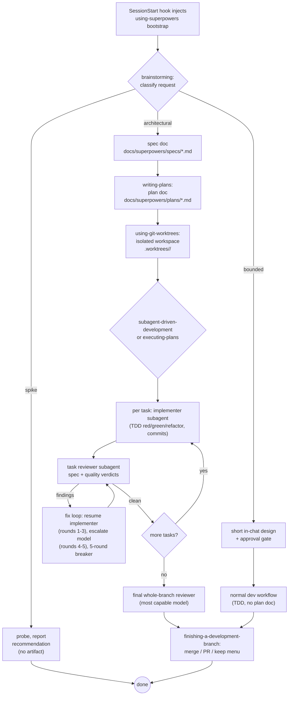

# Superpowers

A process-enforcement skills library for coding agents — brainstorm-gate → plan → TDD → subagent-reviewed implementation → merge, injected into every session via a SessionStart hook.

- Repo: https://github.com/obra/superpowers
- Commit: `b36e082`
- Author: Jesse Vincent / Prime Radiant
- Analyzed: 2026-08-21

## TL;DR

- 14 skills, zero third-party dependencies, distributed as a multi-harness plugin (Claude Code, Codex, Cursor, Gemini CLI, OpenCode, Pi, Hermes, Devin, Grok, Copilot CLI, Antigravity...).
- A `SessionStart` hook (`hooks/session-start`) injects the full text of `skills/using-superpowers/SKILL.md` into every session's context, under an `<EXTREMELY_IMPORTANT>` tag, telling the agent it "must" invoke any skill with even a 1% chance of relevance before doing anything else — this is the entire trigger mechanism; there is no separate search index.
- The house method: `brainstorming` (idea→approved design, three ceremony tiers) → `writing-plans` (bite-sized tasks, 2-5 min each) → `subagent-driven-development` (fresh subagent per task, two-stage review, ledgered rulings) or `executing-plans` (inline) → `finishing-a-development-branch` (merge/PR/keep menu).
- Enforcement is textual, not mechanical: `test-driven-development`, `systematic-debugging`, and `verification-before-completion` each state an "Iron Law" in a fenced block, then pre-empt every rationalization the maintainers observed agents actually use, in an "Excuse | Reality" table.
- `CLAUDE.md` documents a 94% PR rejection rate and treats skill text itself as tested artifact — "Skills are not prose — they are code that shapes agent behavior."

## Inventory

### Skills — 14 total (`find /root/repos/superpowers -name 'SKILL.md' -not -path '*/.git/*'` → 14 files), grouped per README's own taxonomy

**Testing**

| Skill | Path | What it does | When it fires |
|---|---|---|---|
| test-driven-development | `skills/test-driven-development/SKILL.md` | RED→GREEN→REFACTOR; deletes code written before its test | before writing implementation code |

**Debugging**

| Skill | Path | What it does | When it fires |
|---|---|---|---|
| systematic-debugging | `skills/systematic-debugging/SKILL.md` | 4-phase root-cause process; ships root-cause-tracing.md, defense-in-depth.md, condition-based-waiting.md, find-polluter.sh | any bug/test failure, before proposing fixes |
| verification-before-completion | `skills/verification-before-completion/SKILL.md` | Blocks success claims until a verification command has run in that message | before any completion claim |

**Collaboration**

| Skill | Path | What it does | When it fires |
|---|---|---|---|
| brainstorming | `skills/brainstorming/SKILL.md` | Classifies spike/bounded/architectural; Socratic requirements; hard approval gate | before any creative/feature work |
| writing-plans | `skills/writing-plans/SKILL.md` | Fully-specified plan doc, per-task files, exact code, no placeholders | multi-step task, before touching code |
| executing-plans | `skills/executing-plans/SKILL.md` | Inline batch plan execution with human checkpoints | plan execution, subagents unavailable |
| subagent-driven-development | `skills/subagent-driven-development/SKILL.md` | Fresh subagent/task + two-stage review + final review; ledger; 5-round fix loop | executing plans with independent tasks |
| dispatching-parallel-agents | `skills/dispatching-parallel-agents/SKILL.md` | Parallel subagent dispatch on independent problem domains | 2+ independent, no shared-state tasks |
| requesting-code-review | `skills/requesting-code-review/SKILL.md` | Dispatches reviewer subagent via `code-reviewer.md`; Critical/Important/Minor | completing tasks, before merge |
| receiving-code-review | `skills/receiving-code-review/SKILL.md` | Bans performative agreement; read→verify→evaluate→respond | receiving review feedback |
| using-git-worktrees | `skills/using-git-worktrees/SKILL.md` | Detect→native-tool→git-fallback isolation, baseline test run | starting feature work needing isolation |
| finishing-a-development-branch | `skills/finishing-a-development-branch/SKILL.md` | Verify tests → merge/PR/keep menu (discard needs typed confirm) → cleanup | implementation complete, tests pass |

**Meta**

| Skill | Path | What it does | When it fires |
|---|---|---|---|
| using-superpowers | `skills/using-superpowers/SKILL.md` | Bootstrap: mandates checking for a skill before ANY action | injected verbatim at every SessionStart |
| writing-skills | `skills/writing-skills/SKILL.md` | TDD-for-docs: pressure-test before writing; "Match the Form to the Failure" | creating/editing/testing skills |

Total: 1 (testing) + 2 (debugging) + 9 (collaboration) + 2 (meta) = 14, matching the `find` count exactly.

### Hooks

| Event | File | What it enforces |
|---|---|---|
| `SessionStart` (matcher `startup\|clear\|compact`) | `hooks/hooks.json` → `hooks/run-hook.cmd` → `hooks/session-start` | Reads `skills/using-superpowers/SKILL.md`, JSON-escapes it, and emits it as injected context — in one of three shapes depending on the detected harness: Claude Code (`hookSpecificOutput.additionalContext`), Cursor (`additional_context`), or SDK-standard/Copilot CLI (top-level `additionalContext`). This is the *entire* mechanism that makes skills "auto-trigger" — there is no runtime skill-search index; the model reads the bootstrap text and is instructed to call the `Skill` tool itself. |

`tests/hooks/test-session-start.sh` (only file under `tests/hooks/`) asserts: hook declares `shell: "bash"` (Windows dispatch fix, see below), and the three per-harness JSON output shapes are each well-formed and non-empty. There is exactly one hook and one hook test file in the repo.

### Agents / subagents

No persistent named subagent personas exist in the repo. "Subagents" are ad-hoc dispatches of Claude Code's generic `general-purpose` type, driven entirely by prompt templates:
- `skills/subagent-driven-development/implementer-prompt.md` (154 lines) — task-implementer dispatch template.
- `skills/subagent-driven-development/task-reviewer-prompt.md` (207 lines) — per-task two-verdict (spec + quality) reviewer template.
- `skills/subagent-driven-development/re-review-prompt.md` — scoped fix-verification template.
- `skills/requesting-code-review/code-reviewer.md` — general review template (Strengths/Critical/Important/Minor/Assessment), reused as final whole-branch reviewer.
- `skills/brainstorming/spec-document-reviewer-prompt.md`, `skills/writing-plans/plan-document-reviewer-prompt.md` — self-review checklists, not subagent dispatches.

Supporting scripts in `skills/subagent-driven-development/scripts/`: `sdd-workspace` (resolves per-plan workspace `.superpowers/sdd/<plan-basename>/`), `task-brief` (extracts one task's text to a file), `review-package` (writes a diff package file for a reviewer to Read).

## The core engineering flow

1. **using-superpowers** (bootstrap, forced) — every session opens with the skill text injected; any 1%-relevant skill is mandatory.
2. **brainstorming** — classify spike / bounded / architectural. Architectural: explore→clarify→2-3 approaches→sectioned design→spec to `docs/superpowers/specs/YYYY-MM-DD-<topic>-design.md`→self-review→**hard approval gate**. Bounded: short in-chat design, still gated, no spec file. Spike: 2-3 sentence probe, throwaway output.
3. **writing-plans** (architectural only) — approved spec becomes `docs/superpowers/plans/YYYY-MM-DD-<feature-name>.md`: bite-sized (2-5 min) tasks, exact file paths, complete code, an "Interfaces: Consumes/Produces" block, header pointing back at the spec.
4. **using-git-worktrees** — isolates work (native tool, else `.worktrees/<branch>` via `git worktree add`), runs setup, verifies a clean test baseline first.
5. **subagent-driven-development** (preferred) or **executing-plans** (fallback) — per task: dispatch fresh implementer subagent against a `task-brief`; dispatch task reviewer against a `review-package` diff; failures enter a 5-round fix loop (rounds 1-3 resume the implementer, 4-5 escalate to a fresh implementer on a stronger model); all recorded in ledger `.superpowers/sdd/<plan-basename>/progress.md`, which survives context compaction.
6. **test-driven-development** — inside every implementer dispatch: failing test → verify it fails correctly → minimal code → verify green → refactor → commit. Code written before its test is deleted, not adapted.
7. **requesting-code-review / receiving-code-review** — per-task reviewer verdicts spec-compliance and quality separately; final whole-branch reviewer on the most capable model before merge; feedback answered with verification, not gratitude.
8. **verification-before-completion** — gates every "done"/"passes" claim on freshly-run command output in that same message; applies to the controller and to subagent self-reports.
9. **finishing-a-development-branch** — full test run → 3 (or 2, detached HEAD) options: merge locally / push+PR / keep-as-is; discard requires typed word `discard`; cleanup only for worktrees Superpowers created.

Artifacts produced/consumed, by real path:
- Spec: `docs/superpowers/specs/YYYY-MM-DD-<topic>-design.md`
- Plan: `docs/superpowers/plans/YYYY-MM-DD-<feature-name>.md`
- SDD workspace (git-ignored, per-plan): `.superpowers/sdd/<plan-basename>/` containing `progress.md` (ledger), `task-N-brief.md`, `task-N-report.md`, and review-package diff files
- Worktree: `.worktrees/<branch-name>/` (or `worktrees/`, whichever pre-exists; `.worktrees` wins if both exist)

## Core beliefs / principles

- **Evidence before claims, always.** `skills/verification-before-completion/SKILL.md`: `"NO COMPLETION CLAIMS WITHOUT FRESH VERIFICATION EVIDENCE"` — a claim requires a command run *in that message*.
- **Root cause over symptom.** `skills/systematic-debugging/SKILL.md`: `"NO FIXES WITHOUT ROOT CAUSE INVESTIGATION FIRST"`; three failed fixes force an architecture discussion, not a fourth patch.
- **Tests first, no exceptions.** `skills/test-driven-development/SKILL.md`: `"NO PRODUCTION CODE WITHOUT A FAILING TEST FIRST"` — "Write code before the test? Delete it. Start over... Delete means delete."
- **Letter equals spirit.** TDD and debugging skills both state: `"Violating the letter of the rules is violating the spirit of the rules."` — pre-empts "spirit not ritual" rationalization.
- **Approval is a hard gate regardless of task size.** `skills/brainstorming/SKILL.md`: `"the ceremony scales with the task; the approval gate never does."`
- **Skills are mandatory, not advisory.** `skills/using-superpowers/SKILL.md`: `"IF A SKILL APPLIES TO YOUR TASK, YOU DO NOT HAVE A CHOICE. YOU MUST USE IT... This is not negotiable."`
- **Rulings over stalls in autonomous execution.** `skills/subagent-driven-development/SKILL.md`: `"A wrong ruling costs rework your human partner can see and undo; a session parked on a question costs their whole day and buys nothing."`
- **No performative deference to review feedback.** `skills/receiving-code-review/SKILL.md`: `"NEVER: 'You're absolutely right!'... If you catch yourself about to write 'Thanks': DELETE IT."`
- **Skills are tested code, not prose.** `CLAUDE.md`: `"Skills are not prose — they are code that shapes agent behavior... Do not modify carefully-tuned content... without evidence the change is an improvement."`
- **PR quality bar is adversarially high.** `CLAUDE.md`: `"This repo has a 94% PR rejection rate... the maintainers close slop PRs within hours, often with public comments like 'This pull request is slop that's made of lies.'"`

## Mechanics worth stealing

- **Hook-based mandatory context injection.** `hooks/session-start` reads one file (`using-superpowers/SKILL.md`) and re-emits it, JSON-escaped, wrapped in `<EXTREMELY_IMPORTANT>` tags, as `SessionStart` hook output — forces specific text into every fresh or post-compaction context without relying on the model "remembering." Branches output shape by detected harness (`CURSOR_PLUGIN_ROOT` / `CLAUDE_PLUGIN_ROOT`+`COPILOT_CLI` / fallback) so one script serves many platforms.
- **Rationalization tables as the actual enforcement surface.** Every discipline skill ships an "Excuse | Reality" or "Red Flags" table built from *observed* agent rationalizations during pressure testing, e.g. TDD's: `"'Tests after achieve same goals (spirit not ritual)' → 'Tests-first answer "what should this do?"... Test-first forces that failure.'"` `writing-skills/SKILL.md` documents building this table from adversarial subagent test runs — it's the mechanism, not decoration.
- **"Match the Form to the Failure"** (`writing-skills/SKILL.md`): prohibition-based guidance ("don't do X") measurably backfires for shape-of-output problems and should be reserved for pressure-driven rule violations; positive recipes work better for shape problems. Cited evidence: "the prohibition arm produced clearly more of the unwanted content than the recipe arm."
- **Dispatch via files, not pasted history.** `subagent-driven-development/SKILL.md`: `"Everything you paste into a dispatch prompt... stays resident in your context... Hand artifacts over as files."` `scripts/task-brief PLAN_FILE N` writes a task's text to a file; the dispatch references the path, never inlines the plan.
- **Explicit no-recursive-subagents contract.** Implementer and reviewer templates forbid spawning their own subagents — observed failure: `"every reviewer a worker spawned duplicated the task review the controller dispatched anyway."`
- **Ledger survives compaction, not memory.** `"Controllers that lost their place have re-dispatched entire completed task sequences — the single most expensive failure observed."` Fix: `.superpowers/sdd/<plan-basename>/progress.md`, first line names the owning plan, resumed via `git log` + ledger rather than recollection.
- **Typed-word confirmation for destructive actions.** `finishing-a-development-branch/SKILL.md` requires the literal string `discard` before deleting a branch/worktree — `"'Yeah, get rid of it' counts as confirmation" → "Only the typed word 'discard' authorizes deletion."`

## Weaknesses / where it breaks down

- **Ceremony is real even on "light" paths.** Even a "bounded" one-file fix requires stop-and-wait human approval of a stated design before any edit — the gate is never skippable, only shortened.
- **The whole system rests on one hook firing correctly.** If `SessionStart` doesn't fire (hook timeout, or the Windows PowerShell/cmd parser failure the repo's own history shows happened — issues #1751/#1918, fixed by adding `shell: "bash"`), skills are, in the README's words, "dead weight — present on disk but never invoked." There is no independent skill-search fallback; injection is the only trigger.
- **Enforcement is textual/persuasive, not mechanical.** Rules like "no code before test" are enforced by instructing the model harder (rationalization tables, ALL-CAPS, "not negotiable") — no static check or runtime gate can actually stop a model from writing code first. `writing-skills` itself documents this as an ongoing "close the loophole" arms race.
- **SDD's 5-round fix loop + per-task two-stage review + final whole-branch review is a lot of subagent dispatches per unit of shipped code** — tiered model selection mitigates cost but wall-clock latency still multiplies for anything beyond a couple of tasks.
- **Hard approval gates assume a present, attentive human.** SDD's "Rulings, not stalls" model compensates partially but still stops unconditionally for four categories (destructive ops, security-sensitive actions, side effects outside the worktree, unresolvable plan defects).
- **No skill addresses non-code creative/analytical work** — exclusively a software engineering process; anything outside "spec → plan → code → review → merge" has no home here.
- **Contributor governance is heavy by design** (94% PR rejection, mandatory model/harness disclosure, no bundled changes, no "compliance" rewordings without eval evidence) — fine for a curated library, hostile to casual contribution.

## Fit for a solo senior engineer shipping a production feature in a day

**Carries over well:** `verification-before-completion`'s gate function (never claim "tests pass" without a fresh run in that message) is cheap and catches a real failure mode on its own. `systematic-debugging`'s "3+ failed fixes → question the architecture" rule is a useful circuit breaker against exactly the thrashing a deadline invites. The **spike** path in `brainstorming` (2-3 sentence probe, nod, investigate, throwaway) is essentially free and matches how a solo senior engineer already works. `writing-plans`'s "no placeholders" discipline (concrete code in every step, no "similar to Task N") is good practice regardless of speed.

**Pure overhead at this scale:** the full `subagent-driven-development` machinery (ledgers, two-stage per-task review, 5-round fix loop, final capable-model review) is built for long unattended multi-hour runs across many tasks — a solo engineer who already holds full context self-reviews faster than round-tripping through review templates. The architectural-path ritual (spec doc → self-review → user-reviews-spec → separate plan doc) is proportionate for a new subsystem, not "add this endpoint"; a one-day deadline will want to collapse bounded and architectural further than the skill allows. `using-git-worktrees`'s isolation ceremony matters for parallel/subagent work, not solo linear work. The `finishing-a-development-branch` menu and typed-confirmation ritual guard against agent-driven destructive actions; a human running `git merge` themselves needs the underlying caution, not the ceremony.
