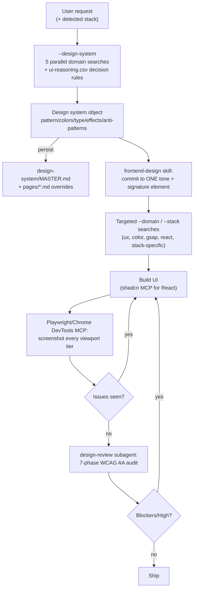

# UI/UX Pro Max Skill

A CSV-backed, BM25-searchable design knowledge base packaged as a Claude Code (and 18-other-agent) skill, paired with a bundled "claudekit" family of adjacent design skills and a separate Playwright-driven design-review workflow.

- Repo: https://github.com/nextlevelbuilder/ui-ux-pro-max-skill
- Commit analyzed: `bc826e2` (shallow clone, single commit visible)
- Date analyzed: 2026-08-21

## TL;DR

- Core deliverable is `src/ui-ux-pro-max/data/*.csv` — 22 files, ~3,060 lines (plus `google-fonts.csv` at 1,935 lines and a 1,512-entry Phosphor icon manifest) — queried by a from-scratch, stdlib-only BM25 engine (`core.py`, 993 lines), never dumped into the prompt.
- The engine runs as a subprocess (`python search.py "<query>" --domain <domain>`), returning ~3-10 rows per call — real progressive disclosure via a search tool, not a giant markdown file.
- `--design-system` composes 5 parallel domain searches (product/style/color/landing/typography) plus a closed, regex-driven "decision rules" JSON grammar (`reasoning_contract.py`) explicitly documented as "non-executable" — no eval, no LLM-authored code path.
- One plugin bundles two products: the nextlevelbuilder-authored `ui-ux-pro-max` data/search skill, and six MIT `claudekit`-authored skills (`design`, `design-system`, `ui-styling`, `brand`, `slides`, `banner-design`) shipping in the same `.claude/skills/` tree and installing together.
- Marketing counts drift: `skill.json` says "84 styles ... 98 UX guidelines"; the machine-generated `catalog-summary.json` (verified 2026-08-13) says 88 total styles (79 searchable) and 119 UX guidelines — five+ files must be hand-synced and at least one has gone stale.

## Inventory

### Skills (`.claude/skills/*/SKILL.md`, mirrored into `cli/assets/skills/`)

| Name | Path | What it does | When it fires |
|---|---|---|---|
| `ui-ux-pro-max` | `.claude/skills/ui-ux-pro-max/` | Searches the CSV knowledge base, generates a "design system" via `search.py` | Any UI/UX task; author nextlevelbuilder |
| `design` | `.claude/skills/design/` | Umbrella: brand identity, logo gen (55 styles), CIP (50 deliverables), slides, banners (22 styles), icons, social photos | "design logo", "create CIP", "build slides"; author claudekit |
| `design-system` | `.claude/skills/design-system/` (244 ln) | Three-layer token architecture + a slide-generation subsystem with its own 8 CSVs and BM25 search | Token creation, Tailwind theming, presentations; author claudekit |
| `ui-styling` | `.claude/skills/ui-styling/` (324 ln) | shadcn/ui + Tailwind + Radix implementation guidance and reference docs | Building React UI, accessible components, dark mode; author claudekit |
| `brand` | `.claude/skills/brand/` | Brand voice, visual identity, messaging frameworks | Branded content, style guides; author claudekit |
| `slides` | `.claude/skills/slides/` (40 ln, pointer into design-system's slide subsystem) | Strategic HTML presentations with Chart.js + copy formulas | Presentation/deck requests; author claudekit |
| `banner-design` | `.claude/skills/banner-design/` (196 ln) | Banner art direction across platforms/styles | Social/ad/hero/print banners; author claudekit |

All seven install together under one `.claude-plugin/plugin.json` entry (`"skills": "./.claude/skills/"`) — not just the flagship one.

### Agents / Commands (`stack/.claude/`, a separate starter-kit subtree, not the plugin proper)

| Name | Role | Model | Tools |
|---|---|---|---|
| `design-review` (agent) | Drives a real browser through a 7-phase audit (setup, interaction, responsive, visual polish, WCAG 2.1 AA, edge cases, console) and returns ranked Blocker/High/Medium/Nitpick findings | `sonnet` | `mcp__playwright, mcp__chrome-devtools, Read, Grep, Glob, Bash` |
| `/design-review` (command) | Invokes the subagent against a URL/file, optional focus argument | — | — |
| `/design-plan` (command) | Runs the ui-ux-pro-max design-system generator, then applies `frontend-design`'s taste lens before any code is written | — | — |

`stack/` is a distinct "Claude Website Design Stack" starter repo bundled inside this one (own README/CLAUDE.md/`.mcp.json`/CI), not part of the installable plugin — it demonstrates wiring the data skill to Playwright/Chrome DevTools/shadcn MCP and a review subagent.

### Knowledge bases (`src/ui-ux-pro-max/data/`, source of truth; mirrored to `.claude/skills/ui-ux-pro-max/data/` and `cli/assets/data/`)

Counts below are from the machine-generated `data/catalog-summary.json` (`verifiedAt: 2026-08-13`), cross-checked with `wc -l`:

| File | Format | Contents | Size/count |
|---|---|---|---|
| `styles.csv` | CSV, 28 cols incl. `Style ID`, `Aliases`, `Status`, `AI Prompt Keywords`, `Implementation Checklist`, `Design System Variables` | UI style taxonomy (glassmorphism, brutalism, neumorphism, Fluent 2, Spectrum...) with colors, effects, a11y risk, checklist, CSS vars | 88 rows; 79 searchable (50 active / 29 supplemental / 9 deprecated) |
| `products.csv` | CSV | Product type → style/landing pattern/dashboard style/color focus/considerations | 192 rows |
| `colors.csv` | CSV, 19 cols | Semantic palette (Primary/On Primary/.../Ring) per product type, 1:1 with `products.csv` | 192 rows |
| `ui-reasoning.csv` | CSV incl. `Decision_Rules` JSON col | Per-product pattern/style-priority/color-mood/effects + machine-parsed conditional rules | 192 rows |
| `typography.csv` | CSV | Font pairings: heading+body, mood keywords, Google Fonts URL, CSS import, Tailwind config | 74 rows |
| `google-fonts.csv` | CSV | Individual Google Fonts: family, category, stroke, classifications, variable axes, popularity rank | 1,935 lines (≈1,934 approved fonts) |
| `google-font-licenses.json` | JSON | License metadata gating promotion into the CSV | 20,185 lines |
| `icons.csv` | CSV | Curated icons: name, keywords, library, import code, semantic role, allowed contexts | 106 lines (105 icons, mostly Phosphor) |
| `phosphor-icons-upstream.json` | JSON | Full upstream Phosphor manifest — validation source, not search-served | 32,582 lines (1,512 icons) |
| `ux-guidelines.csv` | CSV, 10 cols incl. Do/Don't/Code/Severity | Cross-platform UX/a11y rules (nav, forms, focus, WCAG 2.2) | 120 lines (119 guidelines) |
| `app-interface.csv` | CSV | Native/app interface guidelines (iOS/Android/RN) | 33 lines |
| `react-performance.csv` | CSV | React/Next.js perf anti-patterns | 45 lines |
| `charts.csv` | CSV | Chart-type matrix: when (not) to use, data-volume thresholds, a11y grade/fallback, library recs | 26 lines (25 types) |
| `landing.csv` | CSV | Landing-page structural patterns (34-pattern dataset per README) | 35 lines |
| `motion.csv` | CSV | GSAP presets by intensity tier, Do/Don't, perf notes | 18 lines (17 presets) |
| `data/stacks/*.csv` | 22 CSVs, common schema (`Category, Guideline, Description, Do, Don't, Code Good/Bad, Severity, Docs URL, Applies To, Status, Verified At`) | Framework-specific implementation guidance, version-aware | 1,283 lines total (≈1,260 rows) |
| `data-provenance.json` | JSON | Per-fact provenance/audit trail | 1,348 lines |
| `catalog-summary.json` | JSON | Authoritative machine-generated counts + sha256 snapshots + pending candidates | 78 lines |

`design-system` skill's own data (separate catalog, used only for slide generation): 8 small CSVs (11–26 lines each, 150 lines total) — `slide-strategies.csv` (15 deck structures), `slide-layouts.csv` (25 layouts), `slide-copy.csv` (25 copywriting formulas: PAS/AIDA/FAB), etc.

**Runtime loading model:** nothing above is loaded wholesale into context. `SKILL.md` states the pattern directly: *"use `--domain <Domain>` to query full details. The full rule text for every category lives in `references/quick-reference.md` — read it on demand rather than loading it every time."* `search.py` runs as a subprocess (argv, not a context-loaded document) and returns a small ranked slice (`MAX_RESULTS = 3` by default, tunable with `-n`). `references/quick-reference.md` (256 lines) is a static index of all 119 UX guideline IDs for scanning without a search round-trip; `references/pro-rules.md` (117 lines) loads only "before final delivery of native/mobile app UI."

## The core engineering flow

1. **Analyze requirements** — extract product type, audience, style keywords, and stack; stack is *detected* from `package.json`/`pubspec.yaml`/`*.xcodeproj`/`composer.json`, never defaulted (*"Never assume a stack — a hardcoded default silently misroutes every recommendation"*, SKILL.md:71). Produces: query parameters.
2. **Generate design system** (`--design-system`) — 5 parallel domain searches (product/style/color/landing/typography) aggregated, then `ui-reasoning.csv`'s `Decision_Rules` JSON is matched against the query by `reasoning_contract.py`. Produces: a design-system object (pattern, colors, typography, effects, anti-patterns, checklist), optionally persisted to `design-system/<slug>/MASTER.md` + per-page overrides.
3. **Commit to a look** (external `frontend-design` skill, via `/design-plan`) — forces an explicit purpose/tone/constraint/differentiation statement and one signature element, rejecting "AI slop" defaults. Consumes step 2's tokens; produces a stated rationale.
4. **Supplement with targeted searches** (`--domain ux|color|typography|chart|icons|gsap|...`, plus `--stack <name>`) for specific components/bugs. Produces implementation snippets/checklists.
5. **Build** — implement with the resolved tokens/components (optionally shadcn MCP for React).
6. **See it** — open the running page in a real browser (Playwright/Chrome DevTools MCP), screenshot each viewport tier. Lives outside the `ui-ux-pro-max` skill, in the `stack/` starter kit's CLAUDE.md workflow.
7. **Review** (`design-review` subagent / `/design-review`) — 7-phase audit (setup → interaction → responsiveness → visual polish → WCAG 2.1 AA → edge cases → console) across 375/768/1024/1440/1920px, output as ranked Blocker/High/Medium/Nitpick findings anchored to evidence.
8. **Fix and re-screenshot** — Blockers/High gate completion; Medium/Nit do not (*"Never report UI work 'done' without step 4. If you didn't look at it, it isn't finished."*, WORKFLOW.md:80).

## Core beliefs / principles

1. **Search, don't stuff.** *"read it on demand rather than loading it every time"* — SKILL.md:18.
2. **Never fabricate a match.** *"Do not fabricate output... Never present a 0-result search as if it returned data."* — SKILL.md:169-172.
3. **Data over vibes for stack detection.** *"Never assume a stack — a hardcoded default silently misroutes every recommendation."* — SKILL.md:71.
4. **Rules must be closed and inert, never executable.** *"Closed, non-executable grammar for design-system decision rules"* / *"never execute data."* — reasoning_contract.py:2,102.
5. **Never silently discard prior decisions.** *"`--persist` skips writing and leaves it untouched unless you also pass `--force`... Never use `--force` without explicit user authorization."* — SKILL.md:100-104.
6. **Evidence over assumption in review.** *"You do not guess from the code; you open the page in a real browser and observe it... no finding without something you observed."* — design-review.md:13,97.
7. **Blockers gate, nitpicks don't.** *"Distinguish 'broken' from 'I'd prefer.' Only Blockers/High should gate merging."* — design-review.md:93.
8. **One dominant intent per query.** *"Build each query around one dominant intent, using 2-5 meaningful terms... Do not persist unverified output."* — SKILL.md:57.
9. **Provenance and license gates before promoting data.** `"unlicensedFamiliesExcluded": true, "relevanceGateRequired": true` — catalog-summary.json `promotionPolicy`; the refresh workflow runs read-only, human-reviewed.
10. **The visual-feedback loop is the whole point.** *"Most AI design fails because the model never sees what it built and has no opinionated point of view."* — stack/README.md:7.

## Mechanics worth stealing

**Knowledge base without context bloat.** The catalog is CSV, not markdown-in-context: `styles.csv` (88 rows × 28 cols) and `google-fonts.csv` (1,935 rows) sit on disk and are queried via subprocess CLI (`python search.py "<query>" --domain style -n 3`), returning only top-N ranked rows. A from-scratch BM25 (`class BM25` in `core.py`, k1=1.5, b=0.75, stdlib `math.log`/`defaultdict` only — no numpy) ranks rows per domain, combined with regex/alias matching for exact IDs. `UNTRUNCATED_COLS` protects code snippets/checklists from display truncation while everything else caps at 300 chars in human-readable mode (`--json` for full data) — a deliberate token/readability tradeoff.

**A closed grammar instead of free-text "rules."** `ui-reasoning.csv`'s `Decision_Rules` column holds JSON like `{"if_data_heavy":["style:glassmorphism"]}`. `reasoning_contract.py` enforces an allow-list of ~35 condition names and action prefixes (`must_have|constraint|style|pattern|mode`), rejecting anything else at parse time. This is the one place the repo lets data drive behavior beyond simple lookup, fenced off from arbitrary code execution by construction.

**Master + page-override persistence.** `--design-system --persist` writes `design-system/<slug>/MASTER.md` once, then only page-specific *deltas* to `pages/<page>.md` — hierarchical retrieval (*"If the page file exists, prioritize its rules. If not, use the Master rules exclusively"*), so a multi-page build doesn't re-derive tokens per page.

**Self-critique loop with a hard evidence bar.** `design-review` is model-driven but constrained to observation-first reporting: *"If you could not open the page, say so plainly and report only the heuristic-script results — never invent findings"* (design-review.md:94-95). It has a scripted fallback (`design-audit.mjs`) for no-browser cases and a fixed severity taxonomy (Blockers/High/Medium/Nitpicks) mapping directly to a merge/no-merge decision.

**Version-aware stack data instead of one "current" answer.** `WEB_STACK_CURRENT_MAJORS` pins current majors (React 19, Next.js 16, Vue 3...) and stack CSVs carry `Status`/`Applies To`/`Verified At`; search returns *no results* rather than blending generations for an old major (*"search returns no results instead of mixing framework generations"*, README) — deliberate refusal over silently averaging stale and current advice.

**Data integrity as CI, not vibes.** `validate_data.py` (1,091 lines) checks header completeness, duplicate keys, JSON parseability across every CSV; 10 test modules (2,335 lines) plus a scheduled refresh workflow that only writes review artifacts, never commits (*"It never commits, pushes, opens a PR, or merges"*, README).

## Weaknesses / where it breaks down

- **Count drift across surfaces.** `skill.json` (84 styles, 98 UX guidelines) disagrees with the generated `catalog-summary.json` (88 styles / 79 searchable, 119 UX guidelines) and README's badge (192 "reasoning rules," 79 "searchable styles"). Five-plus files must be hand-synced; only semver is automated ("Version numbers are synchronized... during release preparation" — doesn't cover the counts).
- **Taste-by-catalog is still a catalog.** The generator is a lookup-and-merge over pre-authored rows; it recombines ~88 styles × ~192 palettes × 74 pairings but cannot originate a new aesthetic. The repo implicitly admits this by delegating "commit to a look" to a *separate* `frontend-design` skill.
- **Two products, one install.** The plugin bundles the nextlevelbuilder data engine with six `claudekit`-authored skills (logo, CIP, banners, slides, brand) the README's "Premium vs Basic" table frames as premium differentiators — yet their files are present in this open-source checkout. Whether these are functional freebies or mis-scoped inclusion isn't resolved by the repo itself.
- **Python subprocess dependency.** Every search shells out to `python3 search.py`; the skill is inert without Python 3 on PATH, and Windows requires `python` not `python3`.
- **Stack coverage is thin and uneven.** Individual stack files run 50-76 lines (`vue.csv` 50, `javafx.csv` 76) — a handful of rows per framework; heavy desktop users (WinUI/UWP/Avalonia) get comparatively little.
- **Review loop lives outside the installable plugin.** The "see it and iterate" mechanism `stack/README.md` calls the differentiator is a separate starter-kit subtree, not part of `.claude-plugin/plugin.json` — installing the marketplace plugin gets data/search, not the Playwright-driven review agent.
- **Maintenance surface is large.** 22 stack CSVs, a 1,935-row font catalog with license gating, a 1,512-icon upstream manifest, sha256 snapshotting, scheduled refresh — real recurring curation, evidenced by `docs/journals/` phase-by-phase "accessibility refresh" and "web stack freshness" entries dated August 2026.

## Fit for a solo senior engineer shipping a production feature in a day

**Carries over directly:** the `ux-guidelines.csv`/`app-interface.csv` priority table (accessibility → touch targets → performance) is a fast pre-delivery checklist on its own — a single `--domain ux "keyboard focus modal"` query answers a specific question in seconds. `--stack <name>` is similarly narrow and useful for a one-off lookup. The `design-review` 7-phase structure is a genuinely useful checklist even done by hand, with or without Playwright MCP.

**Pure overhead for a single day-scoped feature:** the full `--design-system` ceremony (5 parallel searches, decision-rule matching, MASTER.md + page-override persistence) targets multi-page products maintaining a design system across sessions — for one feature, picking a palette from `colors.csv` by hand is faster. The six bundled `claudekit` skills are irrelevant to shipping a feature and add install/context surface with no payoff. The provenance/licensing/refresh machinery is infrastructure for the *maintainers* of this data, not something a downstream engineer touches — evidence of rigor, not a tool to use.
