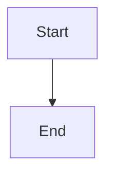

> **In plain terms:** A tiny page to prove the renderer wraps callouts, tables, and mermaid.

## Goal

> **In plain terms:** We need a rendered HTML sibling.

Hello **world** and `code`.

| A | B |
|---|---|
| 1 | 2 |

See [plan.md](plan.md).
